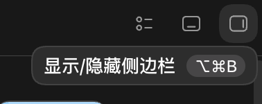
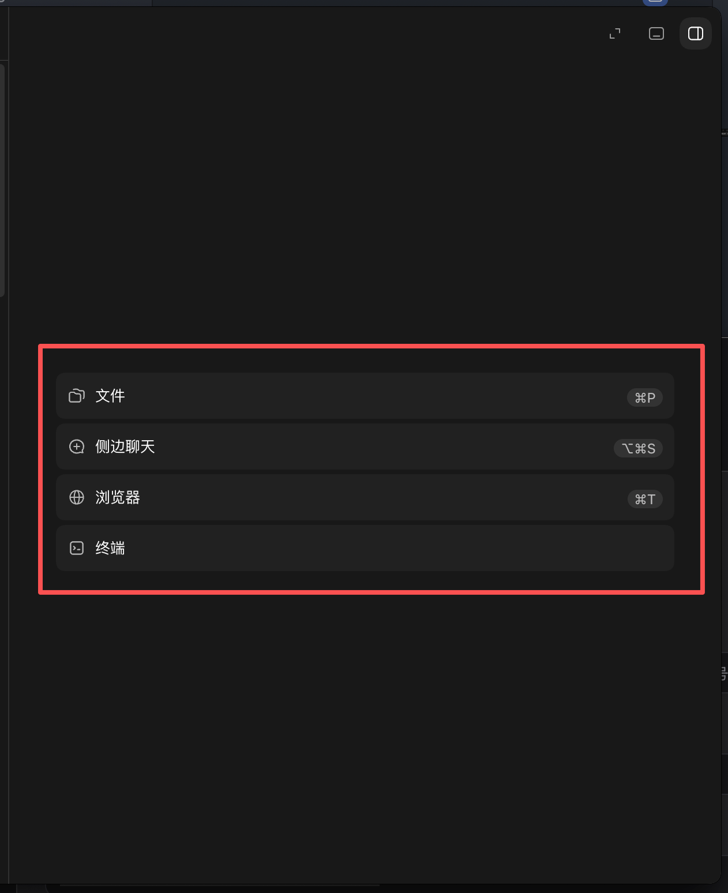
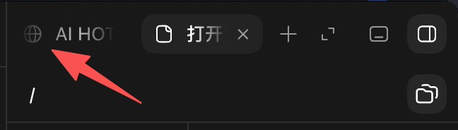
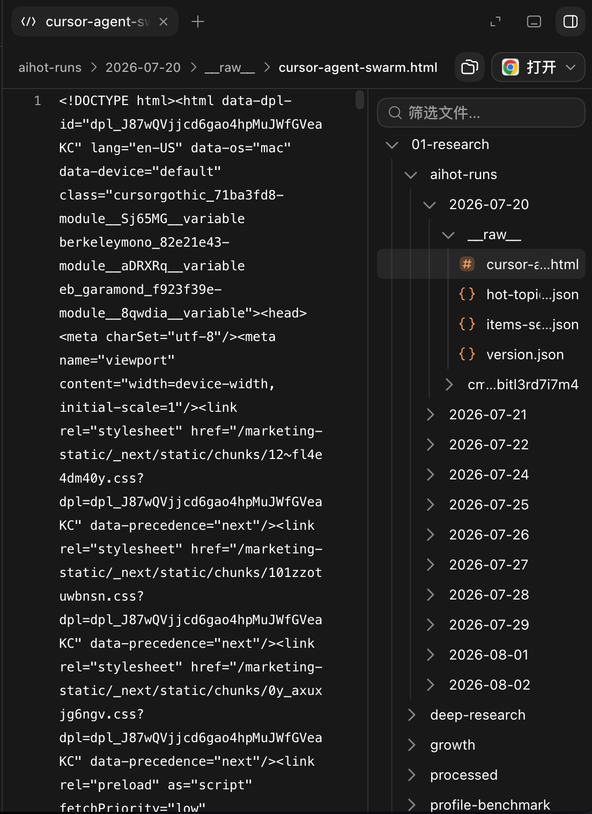
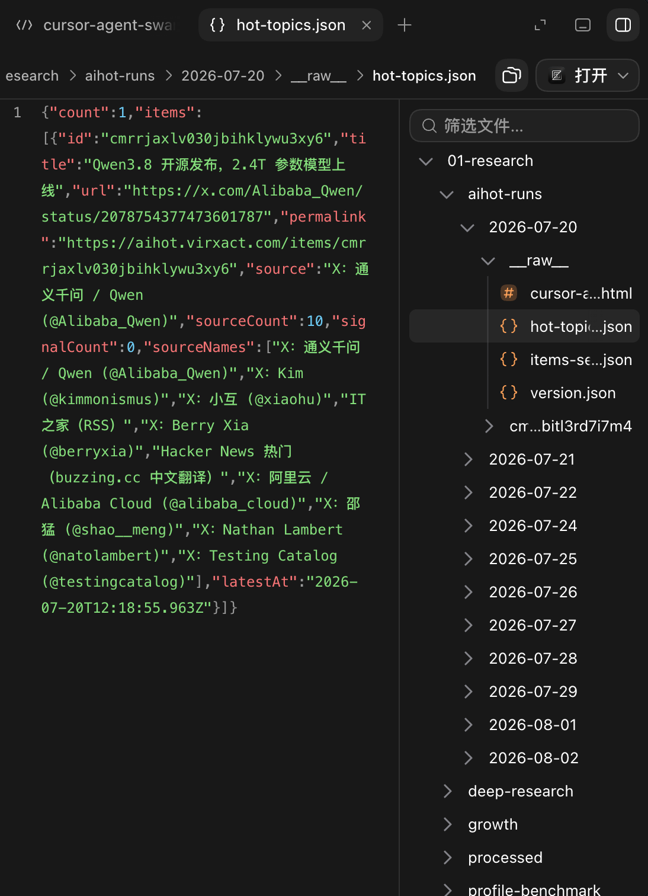
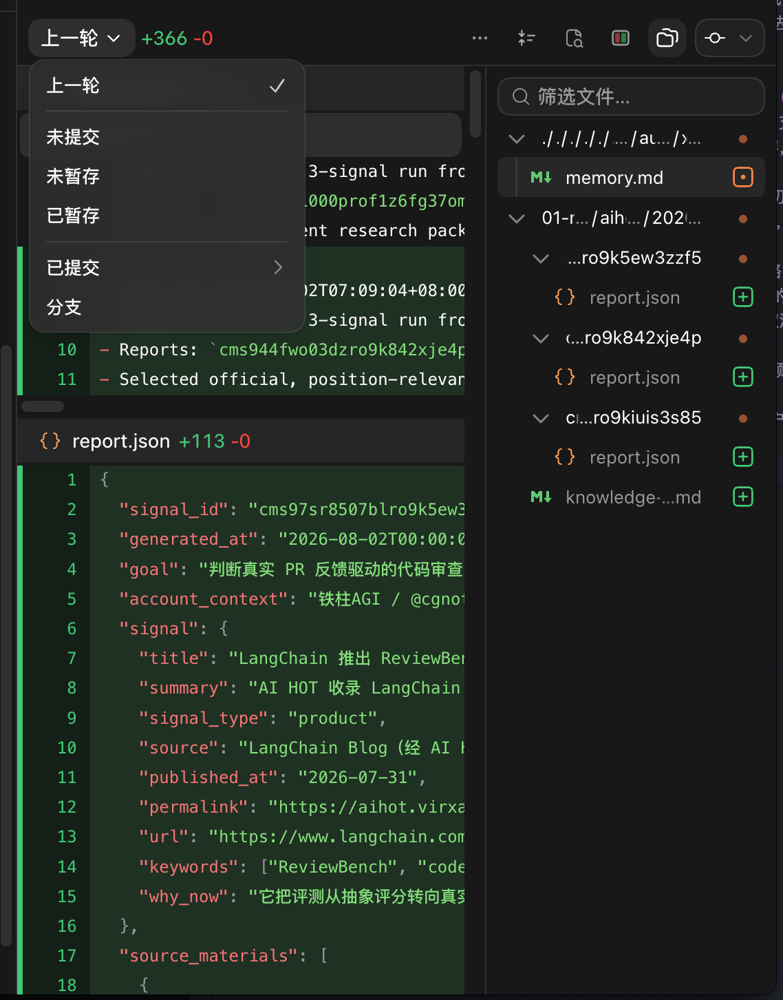
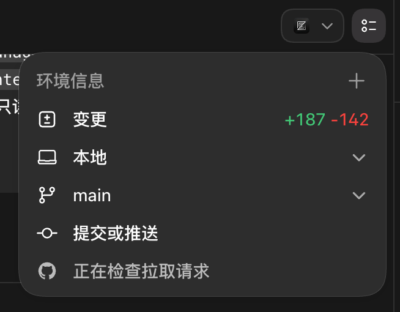
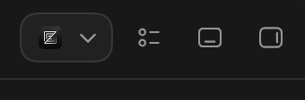

浏览器窗口现在是和资源面板复合使用右侧面板，真个交互设计我没有想好应该怎么做更合理，就觉得现在非常混乱，什么功能都在往顶部栏叠icon，然后去控制右侧资源面板，但是没办法很好处理各个状态。
需要参照 Codex 的设计来完善整个侧栏，让侧栏更有逻辑结构；  
1.入口也改为一样的，有快捷键支持快速打开关闭  
2.通过 icon 点开侧栏没有携带上下文的话，就展开选择页面，支持这几个选项，选择某一项以标签页形式打开对应内容，`侧栏聊天`这个项目先不做，包括下面下拉菜单中也一样  
3.标签页右侧有加号按钮可以打开选择下拉菜单，点击的行为和初始面板的选择一直，点击行为一致，新建标签页打开对应功能；侧栏空间最小宽度 400px，标签太多横向滚动，标签左右侧为这三个 icon，第一个 icon 可以把中间 chat 部分的空间也借给侧栏展示，再次点击取消拓展；第二个暂时忽略；第三个为侧栏控制的 icon；侧栏横向空间不足时，标签页展示部分横向滚动，被遮挡的一头展示渐变黑色遮挡，滚到一头展示完整时黑色遮挡取消（理论横向宽度不调整的情况下，滚动到左侧展示完整遮挡会出现在右侧）；  
4.设置内增加浏览器内核选择，默认使用系统浏览器内核，可以额外下载 chrome 内核，切换后打开浏览器都使用选择的浏览器；  
5.浏览器，终端（复用用户的终端配置，不要自己造一套）不限制打开数量；文件这个类别默认只允许新建一个标签页来承载初始化的文件视图，带文件树，文件夹点击为折叠或者展开，文件点击是创建一个标签页预览文件内容，点击多个文件是创建多个标签页展示不同文件，但是侧栏文件树是不变的，只有文件预览区域改变，不要做成重复创建多个待文件树的容器，这里的多个文件标签页只是映射不同文件的预览区域。；  
6.审阅的功能完全和  对齐，把现在乱七八糟的都抽离到这里  
7.chat 内相关的文件，链接，更改记录的点击都属于携带上下文打开侧栏，要创建符合类型的标签页来合理展示内容；  
8.审阅这个菜单项只有当前会话属于某个 git 项目时才会触发展示，非 git 项目不展示；  
9.把我们右上角区域也进行改造，现在全是 icon，太乱了，模仿 codex 的环境 icon+下拉面板，把所有要展示的信息分组归类从上到下都展示了，点击时携带上下文打开侧栏或者在已经打开的侧栏内新建标签页；  
10. 右上角未展开按照这个来做，我们暂时不做底部打开的面板，这样右上角就只会保留一个软件打开和两个 icon 按钮了；
