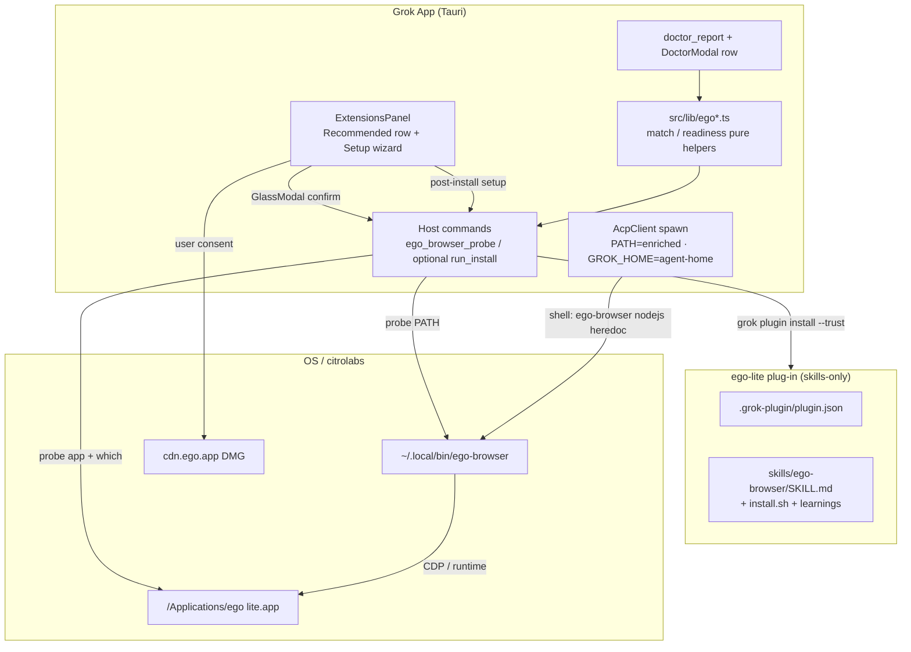
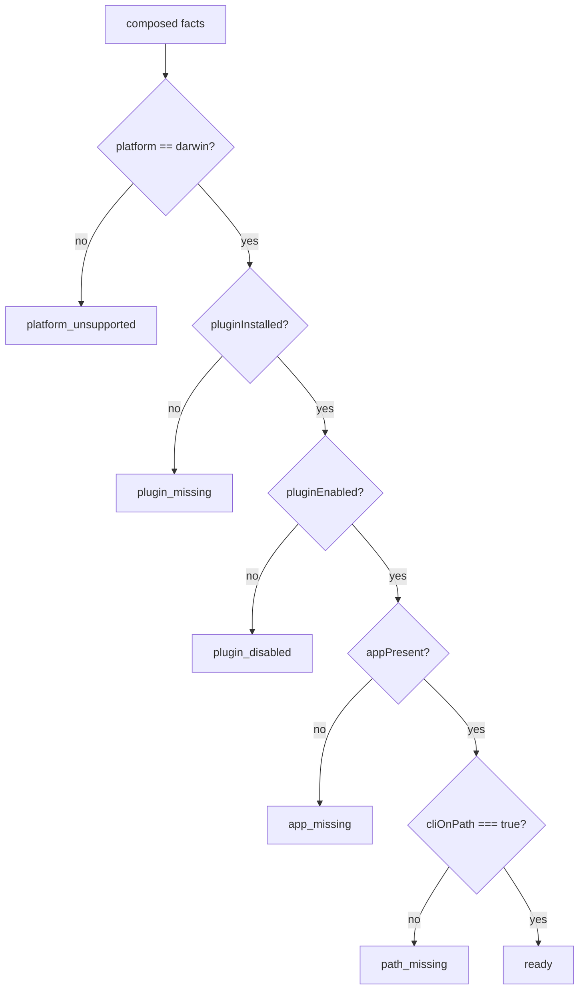
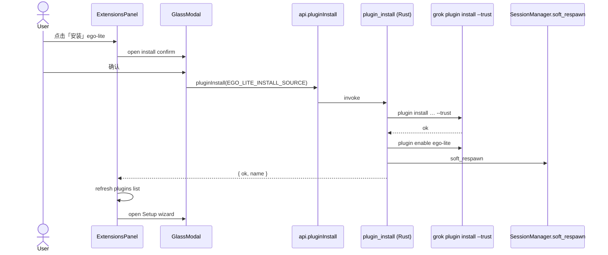
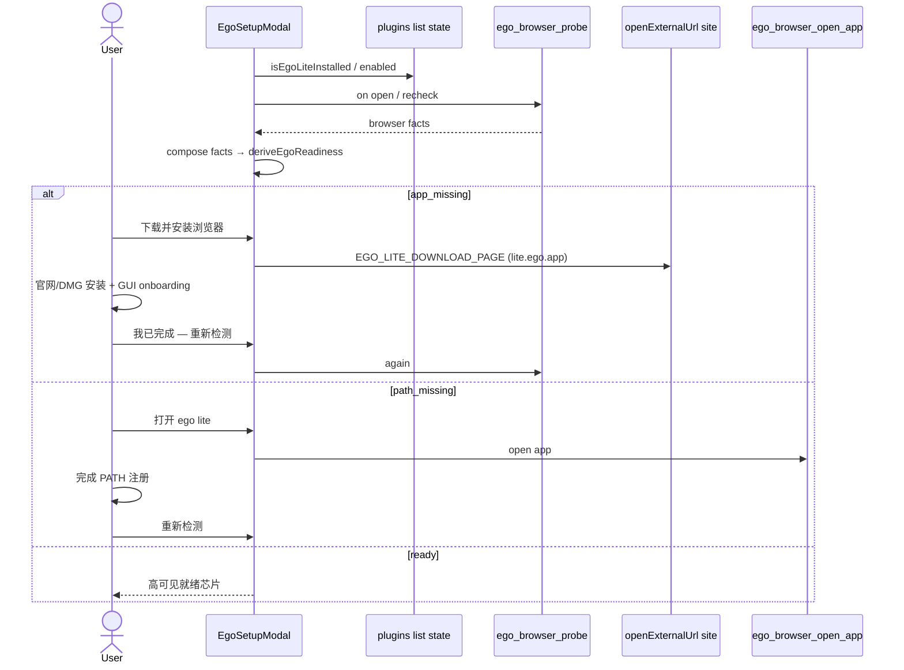
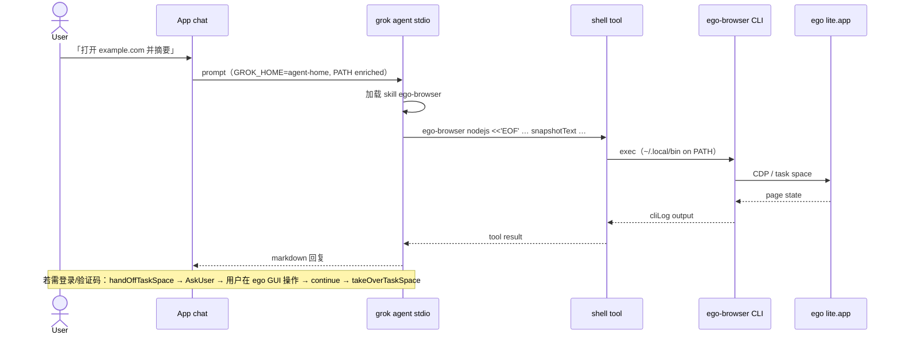
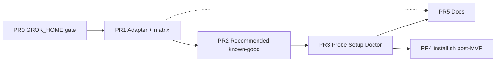

# Design: ego-lite 浏览器自动化外挂集成（Grok App）

| 字段 | 值 |
|------|-----|
| **Title** | Integrate citrolabs/ego-lite as external browser-automation plug-in |
| **Author** | Grok App design (agent-authored) |
| **Date** | 2026-08-05 |
| **Status** | **Approved** (Pi design-doc review, 0 open issues; rev 3) |
| **Upstream** | [citrolabs/ego-lite](https://github.com/citrolabs/ego-lite) (MIT harness + free closed-source browser) |
| **Research SoT** | [`docs/research/ego-lite-browser-automation-plugin.md`](docs/research/ego-lite-browser-automation-plugin.md)（入库后相对 repo root） |
| **Template pattern** | ChatCut recommended plug-in (`pluginRecommended.ts`, `chatcutCodexAdapter.ts`, `scripts/chatcut-plugin-start.mjs`) |

---

## Overview

Grok App 需要**可选的、真实登录态的浏览器自动化**能力：Agent 能打开网站、填表、截图、在隔离 Task Space 中工作，且**不抢占用户日常 Chrome 标签页**。上游 [citrolabs/ego-lite](https://github.com/citrolabs/ego-lite) 已提供：

1. **MIT 开源 harness + skill**（`skills/ego-browser/SKILL.md` + `ego-browser` CLI 协议：`ego-browser nodejs <<'EOF' …`）。
2. **闭源免费 Chromium 应用** ego lite（DMG，macOS only），内嵌 `ego-browser` helper，首次 GUI 引导后把 CLI 注册到 `~/.local/bin`。

**本设计 v1 产品形态**：在 **Settings → Extensions → Plugins → 推荐** 增加第二行 **ego-lite / 浏览器自动化**（与 ChatCut 并列），经 **GlassModal 确认** 后 `plugin install --trust` 安装 **skills-only** 插件；安装后由 App 引导用户下载/安装 **外部** ego lite 浏览器，并用 **Doctor 就绪态**诚实展示 platform / app / PATH 状态。**不**把浏览器嵌进 Tauri WebView；**不**发明 MCP；**不**自动安装插件或 DMG。

实现上严格镜像 ChatCut 的「pin → adapt → fixture → recommended match → GlassModal install」路径，但去掉 MCP/OAuth 面，额外增加 **浏览器安装向导 + `ego-browser` readiness probe**。

---

## Background & Motivation

### 当前状态

| 表面 | 行为 | 缺口 |
|------|------|------|
| **Plugins 推荐** | 仅 ChatCut（`CHATCUT_RECOMMENDED_ID` / `CHATCUT_CODEX_INSTALL_SOURCE`） | 无浏览器自动化推荐 |
| **EmbeddedBrowser** | Resources 内嵌开 URL（ChatCut 编辑器 handoff） | **不是** DOM 驱动自动化 |
| **Skills / shell** | Agent 可跑 Bash；PATH 经 `enriched_path_env()` 注入 | 尚无 ego skill / 浏览器二进制引导 |
| **Doctor** | CLI / MCP / extensions health | 无 `ego_browser_*` 就绪检查 |
| **MCP** | HTTP/stdio 经 agent-home + inject | ego 上游无 `.mcp.json` |

### 痛点

1. 用户期望 Agent「打开网页 / 登录后抓数据 / 填表」，App 仅有内嵌浏览 pane，无法驱动真实登录态与并行空间。
2. 自建 Playwright/MCP 浏览器方案：登录复用弱、与用户浏览器争抢、跨平台成本高。
3. ego 上游已是 **skill + shell CLI**，与 Grok Build agent 模型契合；强行 MCP 化只会重复 skill 面并对抗「code-base heredoc」设计。

### 产品决策（研究结论，不可回退）

- Skills-only 插件（v1 **禁止**自造 MCP）。
- 推荐行与 ChatCut 并列；**从不** auto-install。
- 引导下载闭源 ego lite DMG；**不**嵌入 Tauri WebView。
- macOS-first；Windows/Linux **诚实门控**（不假装 ready）。
- **禁止** fork `SKILL.md` 正文；App 文案走 i18n。
- 确认一律 `GlassModal` / 应用内 dialog；全部 UI 字符串 `createT` / `t()`。

---

## Goals & Non-Goals

### Goals（v1）

1. **Adapter + pin**：从 Codex 布局（`.codex-plugin/plugin.json` + `skills/`）生成 Grok 可装树（`.grok-plugin/plugin.json` + 拷贝 skills，**无** `.mcp.json`）。
2. **Recommended UI**：第二推荐行；match 已安装；GlassModal 确认 → `api.pluginInstall` → enable（Host 已有）→ soft-respawn。
3. **浏览器 Setup 向导（PR3）**：安装插件后引导检测 / 打开官网或文档 / 打开 ego lite 应用 / 重新检测。**不**在 v1 MVP 运行 `install.sh`（consent + allowlisted script 仅 **PR4 post-MVP**）。
4. **Doctor 就绪态**：`platform_unsupported` | `app_missing` | `path_missing` | `ready`（及 probe soft-fail）。
5. **PATH 诚实**：agent spawn 已 enrich `~/.local/bin`；doctor / setup 明确「仅装 DMG ≠ ready」，需完成 onboarding。
6. **i18n**：en / zh / zh-TW 全 key；settings catalog 深链可搜。
7. **文档**：`docs/llm-wiki/ego-browser.md`（对标 `chatcut.md`）；更新 `plugins-marketplace.md` / Agents 索引。
8. **测试**：纯函数单测 + adapter fixture + recommended match 测试；不依赖真实 DMG 下载。

### Non-Goals（v1）

| 不做 | 原因 |
|------|------|
| 自造 MCP wrapper（`run_script` / `snapshot` tools） | 上游无 MCP；与 heredoc 模型冲突；维护成本高 |
| 将 ego lite 嵌入 Tauri / WebView2 | 闭源二进制、体积、许可与支持边界 |
| Windows / Linux 浏览器二进制 | 上游仅 macOS DMG；roadmap 未 ship |
| Fork / 重写 `SKILL.md` 品牌文案 | re-pull 覆盖；App 侧 doctor/i18n 处理 Grok 差异 |
| 将浏览器自动化做成默认 core 功能 | 保持可选 plug-in |
| 自动静默下载 DMG / 静默跑 `install.sh` | 安全与信任；需用户确认 |
| 替换 ChatCut EmbeddedBrowser handoff | 不同产品面（开 URL vs 驱动 DOM） |
| 校验 CDN DMG 签名为 App 责任 | 可记录 SHA 策略为 open question；v1 信任 citrolabs 渠道 + 用户同意 |

---

## Proposed Design

### 架构总览



**控制面（Agent 侧，与上游一致）**：

```text
Grok Build agent
  └─ skill SKILL.md 指示
       └─ shell: ego-browser nodejs <<'EOF'
              helpers: snapshotText / click / fillInput / task spaces …
                 └─ ego lite.app Task Spaces（独立标签，继承登录态）
```

### 与 ChatCut 对照

| 维度 | ChatCut | ego-lite v1 |
|------|---------|-------------|
| Upstream layout | `.codex-plugin` + `.mcp.json` + skills | `.codex-plugin` + skills（**无** MCP） |
| Adapter | `chatcutCodexAdapter.ts` + `chatcut-plugin-start.mjs` | `egoLiteAdapter.ts` + `ego-plugin-start.mjs` |
| Recommended id | `chatcut-codex` | `ego-lite` |
| Install source | `https://github.com/ChatCut-Inc/agent-plugin#codex` | 见下方「安装源策略」 |
| Match names | `codex`, `chatcut` | `ego-lite`, `ego`, `ego-browser` |
| Post-install | MCP OAuth 向导（Extensions → MCP） | **Browser setup wizard**（本设计） |
| Skill fork | 禁止 | 禁止 |
| Platform | 全平台（MCP HTTP） | **浏览器 ready = macOS only** |

### 安装源策略（Key Decision K7 / K15 — **PR2 硬门闩**）

**Ship 规则（不可含 TODO 常量）**：

`EGO_LITE_INSTALL_SOURCE` **仅允许**指向经 PR1 矩阵验证为 **install + enable + non-empty skills** 成功的源。PR2 **禁止**合并「默认 raw git、等以后再改」的占位常量。

| 优先级 | 源形态 | enable 名风险 | 何时用 |
|--------|--------|---------------|--------|
| **A（首选）** | `https://github.com/citrolabs/ego-lite`（若 CLI 接受 Codex/`.grok-plugin` 布局） | leaf = `ego-lite` ✅ | PR1 raw 矩阵 PASS |
| **B** | 发布的 adapted 树 git URL，**最终路径组件必须为 `ego-lite`**（例：`…/ego-lite-grok#…` 或 monorepo subdir 命名为 `ego-lite`） | leaf 必须 = `ego-lite` | raw FAIL |
| **C（dev only）** | 本机绝对路径到 adapted 输出 | **危险**：`…/ego-grok-adapted` → enable `ego-grok-adapted` ❌ | 仅本地调试；**禁止**写进 ship 常量 |

**`plugin_name_from_install_source` 陷阱（已核实 `extensions_p2.rs`）**：

- 文件系统路径 → **目录 leaf** 作为 enable 名。
- 无 `#fragment` 时 git URL → repo leaf。
- ChatCut 用 `#codex` 躲过 leaf；ego 上游 name 已是 `ego-lite`，**git URL 安全**；**adapted 目录名 `ego-grok-adapted` 不安全**。

**硬约束**：

1. Adapter 输出目录可叫 `vendor/ego-grok-adapted`（生成用），但 **ship install source 不得用该 leaf**。
2. 若必须 path 安装：输出到 `vendor/ego-lite/`（leaf=`ego-lite`），或 Host 扩展 `plugin_install` 在成功后读 `.grok-plugin/plugin.json` 的 `name` 再 `plugin enable <json.name>`（推荐 Host 小改，ChatCut 也可受益）。
3. **PR2 AC**：post-install `plugins_list` 中 name ∈ `EGO_LITE_INSTALLED_NAMES` 且 `enabled: true`、skill 非空。
4. **PR1 交付物**：PR body + `docs/llm-wiki/ego-browser.md`（可 stub）记录 raw vs adapted 的 `plugin validate` / 试装矩阵；**矩阵未绿则 PR2 不合并**。

**K15 默认 ship 策略（无网络大 clone）**：

- 单元测试：in-repo fixture `src/lib/fixtures/ego-lite-minimal/`（永不 commit 浏览器二进制）。
- CI adapter：`--source fixture` 或 sparse pin clone（gitignore 大目录）。
- 用户 Recommended：优先 **A**；若 A 失败则 **B**（小体积 adapted release / 子树，目录名 `ego-lite`）。
- `vendor/ego-lite.pin` 始终存在（git URL + commit）。

### 包布局（仓库）

```text
vendor/
  ego-lite.pin                 # source=https://github.com/citrolabs/ego-lite.git commit=<sha>
  ego-lite/                    # optional clone — gitignored if large
  ego-grok-adapted/            # adapter output (may be gitignored; CI regenerates)
    .grok-plugin/plugin.json
    skills/ego-browser/        # COPY (dereference), never hand-edit
      SKILL.md
      references/install.md
      scripts/install.sh
      learnings/...
    assets/                    # if present
    EGO_ADAPT.md               # generated stamp

src/lib/
  fixtures/ego-lite-minimal/   # unit tests only
    .codex-plugin/plugin.json
    skills/ego-browser/SKILL.md
  egoLiteAdapter.ts            # pure adapt / inventory
  egoLiteReadiness.ts          # pure state machine from probe facts
  pluginRecommended.ts         # + ego constants + matchers（或拆 egoRecommended 再 re-export）

scripts/
  ego-plugin-start.mjs         # fetch / adapt / validate（无 register-mcp）
```

**Adapted `.grok-plugin/plugin.json`（illustrative，字段从上游映射）**：

```json
{
  "name": "ego-lite",
  "version": "1.2.5",
  "description": "Browser automation for AI agents through ego lite.",
  "homepage": "https://lite.ego.app/document/",
  "repository": "https://github.com/citrolabs/ego-lite",
  "license": "MIT",
  "keywords": ["browser-automation", "ego-browser"],
  "egoLite": {
    "sourceLayout": "codex",
    "skillsOnly": true,
    "browserPlatform": "darwin"
  }
}
```

**无 `.mcp.json`。** Adapter 不得捏造 MCP 入口。

### 纯函数模块（可单测、无 Node/Tauri）

#### `src/lib/egoLiteAdapter.ts`

| 导出 | 职责 |
|------|------|
| `CODEX_PLUGIN_MANIFEST_REL` / `GROK_PLUGIN_MANIFEST_REL` | 路径常量 |
| `parseJsonObject` | 可复用 ChatCut 同名逻辑或 thin re-export |
| `inventoryEgoLitePackage({ pluginJsonRaw, skillNames, hasSkillsDir })` | 无 MCP 要求；issues 不含 missing `.mcp.json` |
| `adaptEgoLitePackageToGrok({ pluginJsonRaw, skillNames })` | → `grokPluginJson` + `skillNames` + migration notes |
| `egoLiteParityChecklist(adapted)` | `skills_nonempty`, `name_ego_lite`, `no_mcp_required`, `darwin_browser_note` |

**禁止**：读取/写入 skill 正文；禁止「Grok 化」SKILL.md 里的 `Bash` 字样（Grok shell 工具名差异写在 llm-wiki + doctor，不写进 skill）。

#### `src/lib/egoLiteReadiness.ts`

输入为**合成事实**（Host probe + UI/插件列表合并后的 facts），输出 Setup / 已安装芯片 / Doctor 共用状态——**禁止**在纯函数里访问 FS 或 invoke。

```ts
export type EgoPlatform = "darwin" | "windows" | "linux" | "unknown";
export type EgoArch = "arm64" | "x64" | "unknown";

/** Browser-only fields from Host `ego_browser_probe` (no plugin inventory). */
export type EgoBrowserProbeResult = {
  platform: EgoPlatform;
  arch: EgoArch; // for optional DMG URL builder; unused if PR3 opens site only
  appPresent: boolean;
  appPath: string | null;
  cliPath: string | null;
  cliOnPath: boolean;
  runtimeSmokeOk?: boolean | null;
};

/**
 * Full facts for FSM — **composition rule (mandatory)**:
 *   facts = {
 *     ...await egoBrowserProbe(),
 *     pluginInstalled: isEgoLiteInstalled(plugins),
 *     pluginEnabled: findEgoLiteInstalledPlugin(plugins)?.enabled ?? false,
 *     pluginPath: findEgoLiteInstalledPlugin(plugins)?.path ?? null,
 *   }
 * Host Doctor path must soft-list plugins the same way (see Doctor 集成).
 */
export type EgoBrowserProbeFacts = EgoBrowserProbeResult & {
  pluginInstalled: boolean;
  pluginEnabled: boolean;
  pluginPath?: string | null;
};

export type EgoReadinessStatus =
  | "platform_unsupported"
  | "plugin_missing"
  | "plugin_disabled"
  | "app_missing"
  | "path_missing"
  | "ready"
  | "probe_unavailable";

/** Align with `DoctorLevel` = "ok" | "warn" | "fail" only — never invent "info". */
export type EgoUiLevel = "ok" | "warn" | "fail";

export function deriveEgoReadiness(f: EgoBrowserProbeFacts): {
  status: EgoReadinessStatus;
  /** Setup / chip severity — not always emitted to Doctor (see Doctor policy). */
  level: EgoUiLevel;
  statusKey: string; // ext.plugins.ego.status.<status>
  canOfferBrowserInstall: boolean; // darwin + app_missing only; opens site (PR3)
  canOpenApp: boolean;
  /** Doctor: omit row entirely when true (optional capability not in use). */
  omitFromDoctor: boolean;
  doctorLevel: "ok" | "warn" | "fail" | null; // null ⇒ omit
} { /* … */ }
```

**状态机（优先级从高到低）**：



**`ready` 硬条件（Issue re-review 1 — 禁止假绿）**：

```text
ready ⇔ platform===darwin
      ∧ pluginInstalled ∧ pluginEnabled
      ∧ appPresent
      ∧ cliOnPath === true   // enriched PATH 上 which 到 ego-browser
```

- **禁止**仅因 bundle 内 Frameworks helper 填了 `cliPath` 而 `ready`（agent skill 执行的是 shell 里的 `ego-browser` 名，spawn 只 enrich PATH，**不会**把 heredoc 改写成 bundle 绝对路径）。
- `cliOnPath=false` 且 `cliPath` 指向 bundle helper → 仍为 **`path_missing`**；Doctor/Setup 文案可附 `meta.bundleHelperPath` 作诊断提示（「应用内已有 helper，请完成 onboarding 注册到 ~/.local/bin」），level 仍为 **warn**。
- 可选放宽（实现时若做）：`cliOnPath` **或**（`cliPath` 位于 enriched PATH 目录之一 **且** basename 为 `ego-browser` 且可执行）——等价于 shell 能解析，**不是**任意 bundle 深路径。

**Doctor 级别策略（Issue 2 — 选定方案 1+2 混合，不扩展 DoctorLevel）**：

| status | `omitFromDoctor` | `doctorLevel` | 说明 |
|--------|------------------|---------------|------|
| `plugin_missing` | **true** | null | 可选能力未装 → **不发** check 行（避免绿/假 ok） |
| `probe_unavailable` 且未装插件 | true | null | 同上 |
| `plugin_disabled` | false | **warn** | 已装未启用 |
| `app_missing` / `path_missing` | false | **warn** | 已装 skill，浏览器未就绪 — **高可见** |
| `platform_unsupported` 且已装插件 | false | **warn** | skill 在、浏览器不可用 |
| `ready` | false | **ok** | 仅此为绿 |
| `probe_unavailable` 且已装 | false | **warn** | soft-fail 探测 |

纯函数 `level`（Setup 芯片）可对 `plugin_missing` 用 `warn` 引导安装；**不得**映射为不存在的 Doctor `"info"`（`doctorFindings.asLevel` 会把 info→ok，污染健康计数）。

其它说明：

- `platform_unsupported`：**仍可安装 skill**；Setup CTA → 官网/roadmap；**永不** `install.sh` / DMG。
- `path_missing`：app 在但 **`cliOnPath===false`**（含：仅有 bundle helper、`~/.local/bin` 未注册）→ **不得** ready；芯片 + Doctor warn 高可见。
- `runtimeSmokeOk === false`：ready 细节降级为 warn 文案，不新 status（v1 默认不跑 smoke）。

#### `src/lib/pluginRecommended.ts` 扩展

```ts
export const EGO_LITE_RECOMMENDED_ID = "ego-lite";
/** Set only after PR1 gate — must be known-good install+enable source (K15). */
export const EGO_LITE_INSTALL_SOURCE: string; // e.g. git URL or path leaf ego-lite
/** Primary product name from plugin.json — preferred match. */
export const EGO_LITE_PRIMARY_NAME = "ego-lite";
/** Secondary names only when path/source also contains citrolabs/ego-lite. */
export const EGO_LITE_SECONDARY_NAMES = ["ego", "ego-browser"] as const;
export const EGO_LITE_HOMEPAGE = "https://lite.ego.app/";
export const EGO_LITE_DOCS = "https://lite.ego.app/document/";
/** PR3 MVP: open this arch-agnostic site — NOT a template DMG URL. */
export const EGO_LITE_DOWNLOAD_PAGE = "https://lite.ego.app/";
/**
 * Optional pure helper for advanced/PR4 direct DMG (only if product insists).
 * Never open the brace template; always resolve arch first.
 * Channel matches upstream install.sh (subject to upstream change).
 */
export function egoLiteDmgUrl(arch: "arm64" | "x64"): string {
  return `https://cdn.ego.app/channel/egobrowser_npx_referral/setup/macos/${arch}/egolite.dmg`;
}

/** Extend existing match type — path already optional; add enabled for composition. */
export type PluginLikeForMatch = {
  name?: string | null;
  path?: string | null;
  source?: string | null;
  marketplace?: string | null;
  /** From PluginDto; omit ⇒ treat as unknown/false for enabled checks */
  enabled?: boolean | null;
};

export function isEgoLiteInstalled(plugins: readonly PluginLikeForMatch[] | null | undefined): boolean;
export function findEgoLiteInstalledPlugin<T extends PluginLikeForMatch>(…): T | null;
export function egoPluginDisplayName(plugin, egoLabel = "ego-lite"): string;

/** composeEgoFacts accepts PluginDto[] or PluginLikeForMatch[] (enabled+path). */
export function composeEgoFacts(
  probe: EgoBrowserProbeResult,
  plugins: readonly PluginLikeForMatch[] | null | undefined,
): EgoBrowserProbeFacts;
```

**匹配规则（防误匹配 bare `ego` — Issue 11）**：

1. **Primary**：`name.toLowerCase() === "ego-lite"` → installed。
2. **Secondary**：`name` ∈ {`ego`,`ego-browser`} **且** (`path`|`source`|`marketplace`) 含 `citrolabs/ego-lite`（或 adapted 源约定标记）。
3. **Path-only**：name 无关但 blob 含 `citrolabs/ego-lite` → installed（git 装后 name 通常已是 ego-lite）。
4. 单测覆盖：name=`ego` 且无 citrolabs 路径 → **false**；避免 marketplace 其它 ego 插件误伤。

**禁止**把 ego 塞进现有 `pluginDisplayName` 的 ChatCut 分支——独立 `egoPluginDisplayName`，ChatCut 回归测保留。

### Host 命令（Rust）

新增：`src-tauri/src/commands/ego_browser.rs`，在 `lib.rs` 注册。

#### `ego_browser_probe() -> EgoBrowserProbeResult`（**仅浏览器事实**）

**无副作用**。**不**返回 `pluginInstalled` / `pluginEnabled`（那些来自 `plugins_list` + 纯 matchers，见 composition 规则）。

在 `spawn_blocking` 中：

1. `platform`：`macos` → `darwin`，`windows`，`linux`，else `unknown`。
2. `arch`：`aarch64`/`arm64` → `arm64`；`x86_64` → `x64`；else `unknown`（供可选 `egoLiteDmgUrl`；PR3 主路径不依赖）。
3. `appPresent` / `appPath`：  
   - `/Applications/ego lite.app`  
   - `~/Applications/ego lite.app`  
   - 可选：bundle 内 helper 存在性（`Contents/Frameworks/*.framework/Versions/Current/Helpers/ego-browser` 等）。  
   官方 bundle 名是 **`ego lite.app`（有空格）**。
4. `cliPath` / `cliOnPath`：  
   - **复用** `cli_probe` 的 which 模式：`which::which_in("ego-browser", enriched_path_env(), cwd)` + brute-force join dirs（含 `~/.local/bin`）。  
   - 优先抽取共享 `which_on_enriched_path(bin: &str) -> Option<PathBuf>`，避免 Doctor 与 agent PATH 语义分叉（Issue 13）。  
   - 额外：bundle 内 helper 若可执行，可填 `cliPath` / `bundleHelperPath` 作诊断；**`cliOnPath` 仍为 false 时不得 ready**（Setup CTA = 打开 app / 完成 onboarding，不是“用绝对路径当就绪”）。
5. **不**默认 heredoc smoke。  
6. **永不**日志打印页面内容 / Cookie。

#### `ego_browser_open_app() -> { ok, path?, error? }`

- 仅 darwin + appPresent：`open <appPath>`。  
- 非 darwin：`error: "platform_unsupported"`。

#### PR3 下载策略（Issue 6 — **不跑 install.sh**）

| CTA | 行为 |
|-----|------|
| 「下载并安装浏览器」 | `openExternalUrl(EGO_LITE_DOWNLOAD_PAGE)` 或 `EGO_LITE_DOCS` — **站点**，arch-agnostic |
| 「打开文档」 | `EGO_LITE_DOCS` |
| 直接 DMG（非默认） | 仅当显式产品要求：`egoLiteDmgUrl(arch)` 且 `arch != unknown`；URL host ∈ {`cdn.ego.app`,`lite.ego.app`}；`openExternalUrl` 已限 http(s) |

v1 **不**把 brace 模板当 URL 打开。

#### `ego_browser_run_install_script`（**仅 PR4**，高敏）

**PR3 不实现此命令。** PR4 若做，硬性要求：

1. GlassModal 二次确认：点名 **citrolabs / cdn.ego.app**、闭源二进制、**Grok App 不做签名/校验和校验**、可能写 `/Applications`、脚本可能触发系统密码框。  
2. **路径 allowlist**：解析 `scriptPath` 必须为 realpath，且前缀落在 `findEgoLiteInstalledPlugin(plugins).path`（CLI `PluginDto.path`）下的 `skills/ego-browser/scripts/install.sh`。拒绝任意用户路径、拒绝 `curl|sh`、拒绝非 `.sh`。  
3. **仅 darwin**；非 darwin 立即错误。  
4. **Single-flight mutex**（进程内）：busy 时拒绝第二次 invoke；UI `actionBusy` 同步禁用。  
5. `Command`：`sh` + allowlisted abs path；`apply_cli_env_std`；timeout **600s**；stdout/stderr **截断**返回。  
6. **禁止**日志完整脚本 body / DMG URL query secrets。  
7. **不**代用户 auto-sudo：若脚本需管理员，系统弹窗；失败时文案引导用户在 Terminal 手动跑 skill 内 script。  
8. PR 模板勾选 **security review** checkbox 才可合。

#### Doctor 集成（Issue 1, 2, 3, 9, 15）

真实 Host schema（`doctor_p1.rs` / `api/extensions.ts`）：

```ts
// DoctorCheck — use meta, NOT data; level only ok|warn|fail
{
  id: "ego_browser",
  level: "ok" | "warn" | "fail",
  title: "ego lite browser", // English fallback; UI prefers i18n
  detail: string,            // English fallback for export
  meta: {
    status: "ready" | "path_missing" | "app_missing" | "plugin_disabled" | "platform_unsupported" | "probe_unavailable",
    appPath: string | null,
    cliPath: string | null,
    cliOnPath: boolean,
    /** Present when helper found in app bundle but not on PATH — diagnostic only */
    bundleHelperPath?: string | null,
    pluginInstalled: true,   // rows only emitted when true (omit when missing)
    pluginEnabled: boolean,
    platform: string,
  }
}
```

**Host `doctor_report` 组成步骤**：

1. 跑 `ego_browser_probe`（browser facts）。  
2. **Best-effort 轻量 list**（**勿**拖垮 `doctor_report`）：doctor 内 `plugin list --json` 使用 **短超时 5–8s**；**跳过**完整 inspect enrich（name + enabled 足够 primary match）。超时 / 失败 → **omit** ego check（可选能力）。不得让 ego 探测阻塞其它 doctor checks 的返回（可与 probe 并行 `join`，ego 分支软失败）。  
3. **Host Doctor matcher（防漂移 — 选定方案 b）**：仅 **primary** 名 `ego-lite`（case-insensitive）判定 installed；**不**在 Host 复刻 secondary `ego`/`ego-browser`+path 规则。Secondary 匹配留给 TS Setup UI。两端单测：Host 对 bare `ego` **不** emit；TS 对 secondary+citrolabs 仍 match。共享常量名表可写入 `docs/llm-wiki/ego-browser.md`。  
4. 若 `!pluginInstalled`（primary 规则）→ **不 push** check。  
5. 若已装：按 readiness 表 push `level=ok|warn`（**永不** `info`）。  
6. `detail` 英文短句供 export；`meta.status` 供 UI i18n。

**前端 i18n / 导航**：

| 文件 | 改动 |
|------|------|
| `DoctorModal.tsx` `CHECK_TITLE_KEYS` | `ego_browser: "doctor.check.ego_browser"`（或映射到 `doctor.ego.title`） |
| `doctorFindings` category | `id=ego_browser` → 扩展 alias `ego` → **`other`** 可接受，或加 `extensions` 类别（v1 默认 **other**，避免大改 enum）；title 靠 CHECK_TITLE_KEYS |
| Detail 文案 | 读 `check.meta.status` → `tr("doctor.ego.detail." + status)`；fallback `check.detail` |
| CTA「打开浏览器设置」 | 扩展 `onOpenSettings(section, tab?, **anchorId?**)` → `navigateTo("extensions","plugins","settings-anchor-ext-plugins-ego-setup")` → scroll + panel effect 打开 Setup。**禁止** `?focus=` query。未接线则 **omit CTA**。 |

**Enable 状态来源（PR0 后）**：`plugins_list` 的 `enabled` 必须来自 **`{active GROK_HOME}/config.toml`** `[plugins].disabled`（修复后的 `load_disabled_plugin_entries`）。今日代码硬编码 `~/.grok` — **PR0 必改**，不是“仅文档说明”。Doctor / Setup 的 `pluginEnabled` 与 agent 加载使用同一 SoT。

### Frontend UI

#### 组件拆分（Issue 12 — 避免继续膨胀 ~4k 行 ExtensionsPanel）

| 组件 | 路径 | 职责 |
|------|------|------|
| `EgoRecommendedRow` | `src/components/extensions/EgoRecommendedRow.tsx` | 推荐行 UI + badge |
| `EgoInstallConfirmModal` | `…/EgoInstallConfirmModal.tsx` | GlassModal 安装确认 |
| `EgoSetupModal` | `…/EgoSetupModal.tsx` | Setup wizard + recheck + open site/app |
| Panel composition | `ExtensionsPanel.tsx` | 持有 plugins 列表、调用 install API、传入 props；**尽量少**新增 useState（install/setup open flags 可下沉到子组件） |

**禁止**向 `App.tsx` 堆状态（K13）。

#### Recommended section 渲染契约（Issue 10）

当前：`{!chatcutInstalled ? ( section with ChatCut only ) : null}`。

**改为**：

```ts
const showRecommended =
  !cliMissing && (!chatcutInstalled || !egoInstalled);
// Inside section (0–2 rows):
//   {!chatcutInstalled && <ChatCutRow … />}
//   {!egoInstalled && <EgoRecommendedRow … />}
// Section label remains ext.plugins.recommendedTitle ("Recommended" / 「推荐」) — singular is fine for multi-row lists.
// When both installed: showRecommended=false → entire section unmounted (empty section never shown).
// When extQuery active: if panel already filters installed lists by query, recommended section
//   either stays visible (discovery) OR hides when query non-empty and does not match ego/chatcut tokens —
//   **prefer keep recommended visible when query empty; when query set, show row only if name/desc matches query**
//   (pure helper filterRecommendedRows(query, rows)).
```

**Regression**：ChatCut-only 用户（ego 已装或未装）安装/match/GlassModal 路径不得破坏；单测或 manual 清单写明「仅 ChatCut 未装时 section 仍只显示一行」。

| UI 元素 | 行为 |
|---------|------|
| 标题 | `tr("ext.plugins.recommended.egoName")` |
| 描述 | `tr("ext.plugins.recommended.egoDesc")` |
| Badge | 非 darwin：`tr("ext.plugins.recommended.egoMacOnlyBadge")` |
| Install | 打开 `EgoInstallConfirmModal`（**不是**直接 install） |
| Confirm body (darwin) | `egoInstallConfirm` + trust note + Chrome 导入提示（Issue 17） |
| Confirm body (win/linux) | **`egoInstallConfirmWinLinux`** — 明确 skill 可装、**浏览器自动化暂不可用**（Issue 14） |
| 成功后 | refresh；**自动打开** `EgoSetupModal` |

已安装：推荐行隐藏；installed expand 上 **高可见** readiness 芯片（`ready` 绿 / `needsSetup` warn）+ 「浏览器设置…」。

#### Setup Wizard（`EgoSetupModal`，GlassModal size md）

**合成 facts**：`{...probe, pluginInstalled, pluginEnabled}` 每次 open / recheck。

| 状态 | 主 CTA | 次 CTA |
|------|--------|--------|
| `platform_unsupported` | 打开 `EGO_LITE_HOMEPAGE` | 关闭 |
| `plugin_missing` | 关 setup → 开 install confirm | 关闭 |
| `plugin_disabled` | `pluginEnable` | 关闭 |
| `app_missing` | **打开下载页** `EGO_LITE_DOWNLOAD_PAGE`（PR3；非 install.sh） | 我已安装 — 重新检测 |
| `path_missing` | 打开 ego lite app | 重新检测；wiki PATH 说明 |
| `ready` | 完成 | 打开 ego lite |
| `probe_unavailable` | 重试 probe | 打开文档 |

**绝对禁止**：`window.confirm` / `alert`；原生 `<select>`。

**PR4 第二确认**（仅 install.sh）：trust 文案点名 citrolabs CDN、闭源、无签名校验、可能管理员权限、Chrome 数据导入由 ego 处理。

#### 序列图

##### 1) 安装插件



##### 2) 设置浏览器（macOS，PR3）



Note: PR4 才可能在 confirm 后跑 allowlisted `install.sh`；PR3 序列不含 script。

##### 3) 首次 Agent 浏览器任务



### Independent mode / PATH / Sandbox

| 主题 | 现状 | ego v1 动作 |
|------|------|-------------|
| **GROK_HOME + enable SoT（完整 PR0）** | Agent spawn：`GROK_HOME`=agent-home（independent）。今日：`run_grok_cli_args` **未**设 `GROK_HOME`；`load_disabled_plugin_entries` / `user_grok_config_toml()` **硬编码** `~/.grok/config.toml`（`extensions_p1.rs`） | **PR0 MVP 门闩 — 两层必须同向**，不得只修 spawn env：见下节「PR0 完整 SoT」。 |
| **PATH** | spawn 已 enrich `~/.local/bin` | probe 用同一 `which_on_enriched_path`；文档写明 Dock 稀疏 PATH |
| **Sandbox** | 可拦 `/Applications` | Setup + wiki 诚实提示；不静默改 sandbox |
| **Permission / YOLO** | skill 需 shell | 文案说明；不强制改默认 permission |
| **Skill 工具名 `Bash`** | 上游措辞 | wiki 注明 Grok shell；不 fork skill |

#### PR0 完整 SoT：active `GROK_HOME`（Issue re-review 2）

App 默认 `session_data_mode: independent` → agent 读 **agent-home**；今日插件 enable 列表却读 **`~/.grok/config.toml`**。仅给 CLI spawn 注 `GROK_HOME` 而不改 disabled 解析，会出现：list `enabled` 与 agent 实际加载 skill **不一致**。

| # | 改动面 | 要求 |
|---|--------|------|
| 1 | `run_grok_cli_args`（及 extensions 所用 plugin/inspect 调用） | `cmd.env("GROK_HOME", resolve_agent_grok_home(session_data_mode))` |
| 2 | `user_grok_config_toml` / `load_disabled_plugin_entries` | 读 **`{active GROK_HOME}/config.toml`** 的 `[plugins].disabled`，**禁止**永远 `~/.grok` |
| 3 | enable / disable / list 显示的 `enabled` | 与 agent 同一 SoT 文件 |
| 4 | Spike 证据 | 写入 PR0 body；若 CLI 证明插件 inventory **忽略** `GROK_HOME`，诚实记录并调整产品预期 — **不得**在无证据时宣称 PR0 关闭 |

**PR0 手工矩阵（AC，全部在 independent）**：

1. 安装 ego（或 fixture 插件）→ `plugins_list` 显示 installed + `enabled:true`。  
2. **新 agent 会话** skill 可见 / 可触发。  
3. App disable → list `enabled:false` → **新会话**不再加载 skill。  
4. re-enable → skill 恢复。  
5. shared 模式回归：仍读 `~/.grok`（`resolve_agent_grok_home("shared")`）。

ChatCut 与 ego **共用**此修复。

### 平台门控矩阵

| OS | 推荐行 | 插件安装 | 浏览器 Setup | Doctor ready |
|----|--------|----------|--------------|--------------|
| macOS arm64/x64 | 显示 | 允许 | 完整 | 可达 `ready` |
| Windows | 显示 + badge「浏览器仅 macOS」 | 允许 skill（可选隐藏 install browser CTA） | 仅官网/roadmap | 永不 ready |
| Linux | 同 Windows | 同 | 同 | 永不 ready |

**产品选择（推荐）**：Win/Linux **仍显示推荐行**（发现 skill / 未来兼容），安装确认中写明浏览器暂不可用；**不**隐藏推荐导致功能「失踪」。

---

## API / Interface Changes

### TypeScript API（`src/lib/api/…`）

```ts
export type EgoBrowserProbeResult = {
  platform: "darwin" | "windows" | "linux" | "unknown";
  arch: "arm64" | "x64" | "unknown";
  appPresent: boolean;
  appPath: string | null;
  cliPath: string | null;
  cliOnPath: boolean;
  runtimeSmokeOk?: boolean | null;
  // NOTE: no pluginInstalled here — compose on UI / doctor_report
};

export async function egoBrowserProbe(): Promise<EgoBrowserProbeResult>;
export async function egoBrowserOpenApp(): Promise<{ ok: boolean; path?: string; error?: string }>;
// PR4 only:
export async function egoBrowserRunInstallScript(opts?: {
  scriptPath?: string;
}): Promise<{ ok: boolean; message?: string; error?: string }>;

/** Composition helper (pure, in egoLiteReadiness.ts) — plugins need enabled?: boolean */
export function composeEgoFacts(
  probe: EgoBrowserProbeResult,
  plugins: readonly PluginLikeForMatch[] | null | undefined,
): EgoBrowserProbeFacts;
```

既有：

- `pluginInstall` / `pluginEnable` / `pluginsList` — 复用。  
- **可选 Host 小改（随 PR0/PR2）**：`plugin_install` enable 名优先读已装 manifest `name`，避免 path leaf 错误。  
- `openExternalUrl` — PR3 仅打开 `lite.ego.app` / docs（http(s)）。

### Tauri command 注册

| Command | 权限 / 注意 |
|---------|-------------|
| `ego_browser_probe` | 只读 FS + enriched which |
| `ego_browser_open_app` | 仅 open 本地 app bundle |
| `ego_browser_run_install_script` | PR4 only；allowlist + single-flight + consent |

### Settings catalog / deep link（对齐现有 hash/anchor，**禁止**发明 `?focus=`）

核实：`buildSettingsHash` / `parseSettingsHash` **只**处理 section/tab；query 被 strip。SettingsPage 深聚焦靠 **`anchorId` + `scrollIntoView`**（`navigateTo(section, tab, anchorId)`）。Doctor `onOpenSettings(section, tab?)` **今日无** anchor 参数。

**PR3 规范合同**：

1. Catalog 增加 entry：`anchorId: "settings-anchor-ext-plugins-ego-setup"`（挂在 extensions/plugins；keywords: ego setup, 浏览器设置）。  
2. DOM：Setup 入口芯片或已安装行上放 `id="settings-anchor-ext-plugins-ego-setup"`。  
3. Doctor CTA（若接线）：扩展 `onOpenSettings(section, tab?, anchorId?)`（或等价）→ SettingsPage `navigateTo("extensions", "plugins", "settings-anchor-ext-plugins-ego-setup")` → scroll。  
4. **打开 modal**：ExtensionsPanel `useEffect` 在 `highlightAnchor === "settings-anchor-ext-plugins-ego-setup"`（或 pendingAnchor）时 `setEgoSetupOpen(true)` — 与搜索 hit 高亮同路径，**不**新造 `?focus=ego-setup` query 协议。  
5. 若 PR3 来不及扩 `onOpenSettings` 签名：**省略 Doctor CTA**；用户从 Extensions 芯片进入 Setup。

---

## Data Model Changes

| 存储 | 变更 |
|------|------|
| App `extensions.json` | **无**强制 schema 变更；插件 enable 仍以 CLI/config 为准 |
| active `GROK_HOME` plugins + `config.toml` `[plugins]` | CLI install/enable 与 disabled 列表 **同一 home**（PR0）；App 不自建第二套 store |
| `vendor/ego-lite.pin` | 新增 pin 文件 |
| 用户 settings | **不**新增「自动安装浏览器」开关（v1） |

**迁移**：无 DB migration。卸载插件不自动卸载 `/Applications/ego lite.app`（诚实文案说明）。

---

## i18n Keys（完整清单）

文件：`src/i18n/messages/{en,zh,zh-TW}/extensions.ts` + 适量 `doctor.ts`。

### Extensions / Recommended / Setup

| Key | en（示意） | zh（示意） |
|-----|------------|------------|
| `ext.plugins.recommended.egoName` | ego-lite | ego-lite |
| `ext.plugins.recommended.egoDesc` | Browser automation via ego lite (external app). | 通过 ego lite（外部应用）进行浏览器自动化。 |
| `ext.plugins.recommended.egoInstallTitle` | Install ego-lite | 安装 ego-lite |
| `ext.plugins.recommended.egoInstallConfirm` | Install ego-lite from “{source}”? This adds an agent skill. The ego lite browser is a separate macOS download. | 从 “{source}” 安装 ego-lite？这将添加 Agent 技能；ego lite 浏览器需在 macOS 另行下载。 |
| `ext.plugins.recommended.egoInstallConfirmWinLinux` | Install ego-lite skill from “{source}”? The ego lite **browser is not available on this OS** yet — automation will not run until macOS (or upstream Win/Linux) support exists. | 从 “{source}” 安装 ego-lite 技能？**当前系统尚无 ego lite 浏览器**，在 macOS（或上游支持 Win/Linux）前无法做浏览器自动化。 |
| `ext.plugins.recommended.egoMacOnlyBadge` | Browser: macOS only | 浏览器：仅 macOS |
| `ext.plugins.ego.chromeImportNote` | ego lite may offer importing Chrome/browser data (logins/cookies). That happens inside ego lite, not Grok App. Task Spaces can reuse that login state. | ego lite 可能提示导入 Chrome 等浏览器数据（登录态/Cookie）；由 ego lite 处理，Grok App 不读取。Task Spaces 可复用该登录态。 |
| `ext.plugins.ego.setupTitle` | Set up ego lite browser | 设置 ego lite 浏览器 |
| `ext.plugins.ego.setupLead` | The skill controls an external Chromium app — not the in-app browser. | 该技能驱动外部 Chromium 应用，而非应用内浏览器。 |
| `ext.plugins.ego.status.platform_unsupported` | ego lite browser is not available on this OS yet. | 当前操作系统暂不支持 ego lite 浏览器。 |
| `ext.plugins.ego.status.plugin_missing` | Install the ego-lite plugin first. | 请先安装 ego-lite 插件。 |
| `ext.plugins.ego.status.plugin_disabled` | Plugin installed but disabled. | 插件已安装但未启用。 |
| `ext.plugins.ego.status.app_missing` | ego lite app not found. | 未找到 ego lite 应用。 |
| `ext.plugins.ego.status.path_missing` | App found, but `ego-browser` is not on PATH. Finish onboarding in ego lite. | 已找到应用，但 PATH 上没有 `ego-browser`。请在 ego lite 内完成引导。 |
| `ext.plugins.ego.status.ready` | ego-browser is ready. | ego-browser 已就绪。 |
| `ext.plugins.ego.status.probe_unavailable` | Could not probe ego lite (soft-fail). | 暂时无法检测 ego lite（软失败）。 |
| `ext.plugins.ego.cta.installBrowser` | Open download page | 打开下载页 |
| `ext.plugins.ego.cta.openApp` | Open ego lite | 打开 ego lite |
| `ext.plugins.ego.cta.recheck` | I’ve finished setup — recheck | 我已完成设置 — 重新检测 |
| `ext.plugins.ego.cta.openDocs` | Docs | 文档 |
| `ext.plugins.ego.cta.openSite` | lite.ego.app | lite.ego.app |
| `ext.plugins.ego.trustTitle` | Install third-party browser? | 安装第三方浏览器？ |
| `ext.plugins.ego.trustBody` | Runs third-party install.sh: downloads a closed-source app from citrolabs (cdn.ego.app), may write to Applications and prompt for admin. Grok App does **not** ship or signature-verify this binary. Optional Chrome data import is handled by ego lite. | 将运行第三方 install.sh：从 citrolabs（cdn.ego.app）下载闭源应用，可能写入「应用程序」并弹出管理员权限。Grok App **不**内置且**不**校验该二进制签名。可选 Chrome 数据导入由 ego lite 处理。 |
| `ext.plugins.ego.sandboxHint` | Browser tasks need shell access and may fail under strict sandbox. | 浏览器任务需要 shell 权限；严格沙箱下可能失败。 |
| `ext.plugins.ego.installedChip.ready` | Browser ready | 浏览器就绪 |
| `ext.plugins.ego.installedChip.needsSetup` | Browser setup needed | 需设置浏览器 |
| `ext.plugins.ego.setupAction` | Browser setup… | 浏览器设置… |

### Doctor

| Key | en | zh |
|-----|----|----|
| `doctor.check.ego_browser` | ego lite browser | ego lite 浏览器 |
| `doctor.ego.title` | ego lite browser | ego lite 浏览器 |
| `doctor.ego.detail.ready` | Ready ({cliPath}) | 已就绪（{cliPath}） |
| `doctor.ego.detail.path_missing` | App present; finish ego lite onboarding so `ego-browser` is on PATH | 已安装应用；请完成 ego lite 引导以使 `ego-browser` 在 PATH 上 |
| `doctor.ego.detail.app_missing` | Plugin present; browser app not installed | 插件已装；未安装浏览器应用 |
| `doctor.ego.detail.plugin_disabled` | Plugin installed but disabled | 插件已安装但未启用 |
| `doctor.ego.detail.platform_unsupported` | Browser automation unavailable on this platform | 此平台不可用浏览器自动化 |
| `doctor.ego.detail.probe_unavailable` | Could not probe ego lite | 无法检测 ego lite |
| `doctor.ego.cta.setup` | Open browser setup | 打开浏览器设置 |

注：`plugin_missing` **无** Doctor detail key（行被 omit）。`doctor.ego.cta.setup` 仅在 deep-link 接线后使用。

`messages.test.ts` 强制 en/zh/zh-TW key 对齐。

---

## Failure Honesty Matrix

| 场景 | UI 表现 | 禁止 |
|------|---------|------|
| CLI missing | 安装按钮 disabled + 既有 `ext.error.cli*` | 假装已安装插件 |
| `plugin install` 失败 | `actionError` 原文截断；可 Retry | 标记 installed |
| Raw git 装上但 skills 空 | validate / doctor warn；文档指向 adapted 路径 | 静默空 skill |
| 非 macOS 点「安装浏览器」 | 文案：不支持 + 官网 | 跑 install.sh |
| DMG 下载失败 | soft-fail 错误 + 打开官网备选 | 无限重试无提示 |
| 仅拷贝 app / 仅有 bundle helper、未 onboarding | `path_missing`（即使 `cliPath` 有值），非 ready | 显示绿色就绪 / `cliOnPath=false` 当 ready |
| sandbox 拒绝对外 app | Agent 错误透传；setup 显示 sandboxHint | 静默改 sandbox |
| probe 抛错 | `probe_unavailable` warn | fail 整个 Extensions 页 |
| 用户拒绝 trust modal | 关闭；无下载 | 后台仍下载 |
| 卸载插件 | 列表移除；**不**删 `/Applications/ego lite.app`；文案说明 | 静默删浏览器 |

---

## Alternatives Considered

### A. Skills-only Recommended 插件 + Setup Doctor（**采纳**）

- **Pros**：对齐上游；复用 ChatCut 路径；无 MCP 债；外置浏览器安全边界清晰。  
- **Cons**：macOS-only 浏览器；依赖闭源 CDN；多一步 onboarding。

### B. Thin MCP stdio wrapper（`run_script` / `status`）

- **Pros**：Extensions → MCP 可见工具列表。  
- **Cons**：上游无协议；与 heredoc 多步 JS 设计冲突；OAuth/工具 UX 无收益；维护双面。  
- **Verdict**：v1 拒绝；仅当上游官方 MCP 或可证明离散 tools 优于 skill 时重开。

### C. Playwright / agent-browser only（无 ego）

- **Pros**：跨平台、开源。  
- **Cons**：登录复用弱；与用户浏览器争用；集成工作量更大；非本 research 方向。  
- **Verdict**：可作为未来并行推荐，不挡 ego v1。

### D. Core 内嵌 / 重打包浏览器进 Tauri

- **Pros**：一键「内置」。  
- **Cons**：闭源许可、体积、更新通道、安全面；违反「外挂」目标。  
- **Verdict**：明确 no-go。

### E. 仅 skill 拷贝、无 Recommended UI

- **Pros**：工程量更小。  
- **Cons**：可发现性差；无统一 trust / doctor；与 plugins-marketplace 产品面不一致。  
- **Verdict**：劣于 A。

---

## Security & Privacy Considerations

| 威胁 | 严重度 | 缓解 |
|------|--------|------|
| 第三方 skill 以 agent 权限执行 | High | GlassModal + `installTrustNote`；从不 auto-install；`--trust` 仅在确认后 |
| `install.sh` / CDN 闭源 DMG（PR4） | High | 路径 allowlist（仅已装插件 skill 下 script）；single-flight；二次确认点名 citrolabs/cdn.ego.app；**无签名校验 — 文案诚实**；PR3 仅开官网 |
| `sudo` / 写 `/Applications` | High | 不代用户 auto-sudo；系统密码框；失败引导 Terminal 手动 |
| 任意 scriptPath 注入 | High | realpath 前缀必须 ∈ plugin.path/skills/ego-browser/scripts/ |
| 浏览器自动化 + 真实登录态 | High | install + setup 文案；`chromeImportNote`；Task Spaces 复用登录；handoff 需显式 continue |
| Chrome profile 导入 | Med | 由 ego lite GUI 完成；App 不读 Chrome；用户知情同意在 confirm/setup |
| Agent shell 逃逸 | Med | permission_mode / sandbox；wiki |
| PATH 劫持 | Med | enriched which + known paths + 展示解析路径 |
| 日志泄露 | Med | 不记 heredoc/脚本全文；redact |
| 供应链 pin 漂移 | Med | `vendor/ego-lite.pin`；re-pull 人工 |

**隐私**：Setup lead + install confirm 均展示 `chromeImportNote`（Issue 17）。

---

## Observability

| 信号 | 方式 |
|------|------|
| probe 结果 | `tracing` info：platform, appPresent, cliOnPath（**无**页面 URL） |
| install plugin | 既有 plugin 路径日志 |
| install.sh exit | Host 返回 code + 截断 stderr；UI error |
| Doctor export | `ego_browser` check 进入 support bundle |
| 指标（可选） | 本地无强制 telemetry；不新增云端埋点 |

**延迟目标**：

| 路径 | 预算 |
|------|------|
| `ego_browser_probe` | **&lt; 500ms** p95（无 smoke） |
| Doctor 内 ego 分支（probe ∥ 短超时 plugin list） | **&lt; 8s** 硬上限；超时 omit ego 行，**不**拖长整个 `doctor_report` 超过既有 CLI doctor 部分 |
| Setup 打开 | 异步 probe + 已有 plugins 状态；skeleton 先画 |

---

## Rollout Plan

1. **Feature 可见性**：无远程 flag；代码合入即显推荐行。  
2. **阶段（修订）**：  
   - **PR0 spike（门闩）** → 若 fail 则 GROK_HOME fix **阻塞 PR2**  
   - PR1 adapter + **install-source 矩阵**（阻塞 PR2）  
   - PR2 Recommended UI（仅 known-good source）  
   - PR3 probe + Setup（开站点）+ Doctor  
   - PR5 docs（可与 PR3 并行 draft）  
   - PR4 install.sh **post-MVP + security review**  
3. **回滚**：revert 推荐行 + Host；不删用户浏览器。  
4. **CHANGELOG**：macOS-only、第三方、非内嵌、independent GROK_HOME 行为。

---

## Open Questions

1. **Raw git install 矩阵结果**（工程实测，PR1 关闭）— 决定 K15 A vs B。  
2. ~~GROK_HOME~~ → **提升为 PR0 门闩决策**，不再是开放产品问题。  
3. ~~PR3 install.sh vs site~~ → **已决：PR3 = site only**。  
4. **DMG checksum 钉扎** — 仍 open；v1 不验证签名，文案诚实。  
5. **Win/Linux 隐藏推荐行？** — 默认显示 + badge；产品若嫌吵可改（需用户输入）。  
6. **runtime smoke** — 默认否。  
7. **Doctor CTA** — 用 **anchorId** 路径（非 `?focus=`）；时间不够则 omit CTA。

---

## References

- Research: `docs/research/ego-lite-browser-automation-plugin.md`
- Wiki: `docs/llm-wiki/chatcut.md`, `plugins-marketplace.md`, `setup.md`, `dialogs.md`, `i18n.md`
- Code:  
  - `src/lib/pluginRecommended.ts`, `pluginRecommended.test.ts`  
  - `src/lib/chatcutCodexAdapter.ts`  
  - `scripts/chatcut-plugin-start.mjs`  
  - `src/components/ExtensionsPanel.tsx`（recommended + GlassModal install）  
  - `src-tauri/src/commands/extensions_p2.rs`（`plugin_install` / enable / soft_respawn）  
  - `src-tauri/src/process_util.rs`（`enriched_path_env`）  
  - `src-tauri/src/acp_client.rs`（PATH + `GROK_HOME` spawn）  
  - `src-tauri/src/commands/doctor_p1.rs`  
  - `src/lib/api/extensions.ts`, `src/lib/api/system.ts`（`openExternalUrl`）  
- Upstream:  
  - https://github.com/citrolabs/ego-lite  
  - `.codex-plugin/plugin.json` name `ego-lite`  
  - `skills/ego-browser/SKILL.md`, `references/install.md`, `scripts/install.sh`  
  - DMG: `https://cdn.ego.app/channel/egobrowser_npx_referral/setup/macos/{arm64|x64}/egolite.dmg`  
  - Site: https://lite.ego.app/

---

## Acceptance Criteria（全局）

1. macOS：推荐行安装 skill（GlassModal；无 auto-install）。  
2. Setup 区分 `app_missing` / `path_missing` / `ready`；`path_missing`/`needsSetup` 芯片 **高可见**（Issue 19）。  
3. `ready` iff darwin + plugin enabled + app + **`cliOnPath===true`**（enriched PATH 上 which 到 `ego-browser`）；bundle-only helper / DMG-only 未 onboarding → `path_missing`，**不得** ready。  
4. Windows/Linux：永不 ready；不跑 install.sh；install confirm 用 WinLinux 文案。  
5. Independent 默认模式下安装后 **agent 新会话可见 skill**（PR0 门闩）；heredoc 手工验收。  
6. 无 `window.confirm`；i18n 三语对齐。  
7. 无 MCP / 无 skill fork。  
8. `EGO_LITE_INSTALL_SOURCE` 为 known-good；post-install name ∈ matchers 且 enabled。  
9. Doctor：`meta` 非 `data`；level ∈ ok|warn|fail；未装插件 **omit** 行；已装未就绪 **warn**。  
10. 单测：match（含 bare `ego` 假阳性）、readiness、adapter、DMG URL builder。  
11. llm-wiki + 排障 PATH/onboarding。  
12. ChatCut 推荐/安装回归通过；recommended section 双行逻辑正确。

---

## Key Decisions

| # | 决策 | 选择 | 理由 |
|---|------|------|------|
| K1 | 集成形态 | **外挂 Recommended 插件**，非 core | 可选、可卸载、对齐 plugins IA |
| K2 | Agent 接口 | **Skills-only**，v1 无 MCP | 上游 SoT |
| K3 | 浏览器载体 | **外部 ego lite.app** | 闭源、Task Spaces |
| K4 | 平台 | **macOS-first**；Win/Linux 诚实 | 上游 DMG only |
| K5 | UI 模板 | **镜像 ChatCut** GlassModal | trust / soft-respawn |
| K6 | Skill 正文 | **禁止 fork** | re-pull 覆盖 |
| K7 | 安装源 enable 名 | ship source 的 enable leaf 必须是 `ego-lite`；禁止 `ego-grok-adapted` path | Host path→leaf 陷阱 |
| K8 | 浏览器安装 v1 | **PR3 = 打开 lite.ego.app / docs + open app**；PR4 才 install.sh | 降供应链风险 |
| K9 | Doctor | **未装 omit 行**；已装未就绪 `warn`；就绪 `ok`；**无 `info` level**；字段用 **`meta`** | 匹配 `DoctorLevel` / schema |
| K10 | PATH | `enriched_path_env` + 共享 `which_on_enriched_path` | 与 agent 一致 |
| K11 | 对话框 | 仅 GlassModal | dialogs.md |
| K12 | i18n | `ext.plugins.ego.*` / `doctor.ego.*` / `doctor.check.ego_browser` | i18n.md |
| K13 | 状态归属 | 禁止 App.tsx；**拆** `src/components/extensions/Ego*` | 可维护性 |
| K14 | 卸载 | 不自动卸浏览器 | 防误删 |
| K15 | Ship install source | PR1 矩阵后锁定 A(raw git) 或 B(adapted 且 leaf=`ego-lite`)；**禁止** TODO 常量进 PR2 | 可安装性门闩 |
| K16 | Independent GROK_HOME | **PR0**：CLI env **+** `load_disabled_plugin_entries` 读 active home；矩阵通过后才 PR2 | list/enabled/agent 一致 |
| K19 | `ready` 定义 | **仅** `cliOnPath===true`（非 bundle-only `cliPath`） | skill 依赖 PATH 上的 `ego-browser` |
| K20 | Doctor Host match | Host **仅** primary `ego-lite`；secondary 留给 TS | 防规则漂移 |
| K21 | Doctor deep-link | **anchorId** + scroll；扩展 `onOpenSettings` 可选；禁止 `?focus=` | 对齐 settingsCatalog |
| K17 | Probe vs plugin facts | Host probe **仅浏览器**；plugin 态由 `plugins_list` 合成 | 避免假 API |
| K18 | 下载 URL | PR3 用站点常量；DMG 需 `egoLiteDmgUrl(arch)` | 无 brace 模板 |

---

## PR Plan

### PR0 — Active `GROK_HOME` for plugin CLI **and** enable/disable SoT（**MVP 门闩**）

| 字段 | 内容 |
|------|------|
| **Title** | fix(extensions): plugin inventory + enabled SoT under active GROK_HOME |
| **Depends on** | — |
| **Files** | `extensions_p1.rs`：`run_grok_cli_args`、`user_grok_config_toml`、`load_disabled_plugin_entries`；`extensions_p2.rs` list/enable 路径；`chatcut.md` + ego wiki |
| **Description** | **完整 SoT（非仅 env）**：(1) 所有 extensions plugin CLI 调用设 `GROK_HOME=resolve_agent_grok_home(session_data_mode)`；(2) disabled 列表读 `{GROK_HOME}/config.toml` 而非硬编码 `~/.grok`；(3) spike ≤0.5d + 手工矩阵（install→skill 可见→disable→skill 消失→enable）。若 CLI 忽略 GROK_HOME，诚实记录。ChatCut+ego 共用。 |
| **Tests** | Rust：config 路径随 mode 变化；env 注入；手工 independent 五步矩阵 |
| **AC** | **阻塞 PR2**：independent 下 list `enabled` 与 agent skill 加载一致；disable/enable 往返正确；shared 模式不回归 |

---

### PR1 — Adapter + pin + fixture + **install-source 矩阵**

| 字段 | 内容 |
|------|------|
| **Title** | feat(ego-lite): skills-only adapter, pin, validate matrix |
| **Depends on** | PR0 go/no-go 记录（fix 已合或 skip 有据） |
| **Files** | `vendor/ego-lite.pin`；`egoLiteAdapter.ts` + test；fixture；`scripts/ego-plugin-start.mjs`；gitignore；**stub** `docs/llm-wiki/ego-browser.md` 矩阵表 |
| **Description** | skills-only adapt；**记录** raw git vs adapted：`plugin validate` + 试 `plugin install --trust` + enable + skill 非空。输出 **K15 锁定值** 供 PR2 常量。Adapter 输出目录可 `ego-grok-adapted`，但 ship 路径 leaf 必须 `ego-lite` 或纯 git URL。可选：Host enable 读 manifest name。 |
| **Tests** | fixture adapt；script gating |
| **AC** | fixture PASS；矩阵写入 PR+wiki stub；**无 known-good source → 不进 PR2** |

---

### PR2 — Recommended UI + known-good install

| 字段 | 内容 |
|------|------|
| **Title** | feat(extensions): recommended ego-lite install (known-good source) |
| **Depends on** | PR0 + PR1（矩阵绿） |
| **Files** | `pluginRecommended.ts` + tests；`EgoRecommendedRow` / `EgoInstallConfirmModal`；`ExtensionsPanel` composition；i18n（含 WinLinux confirm、chromeImportNote）；settings catalog keywords |
| **Description** | `EGO_LITE_INSTALL_SOURCE` = PR1 锁定值；`showRecommended` 双行；GlassModal；match 防 bare `ego`；**无** probe。 |
| **Tests** | match 矩阵；ChatCut 回归；section visibility |
| **AC** | 安装后 name enabled 且 ∈ matchers；从不 auto-install；非 darwin 确认文案不承诺浏览器；无 MCP |

---

### PR3 — Probe + Setup（站点）+ Doctor `meta`

| 字段 | 内容 |
|------|------|
| **Title** | feat(ego-lite): browser probe, setup wizard, doctor row |
| **Depends on** | PR2 |
| **Files** | `egoLiteReadiness.ts`；`ego_browser.rs`；api；`EgoSetupModal`；`doctor_p1.rs`（**meta** + omit 未装 + 短超时 list）；`DoctorModal` CHECK_TITLE_KEYS；catalog `settings-anchor-ext-plugins-ego-setup`；可选 `onOpenSettings` anchor 参数；i18n |
| **Description** | compose facts；`ready` **仅** `cliOnPath`；PR3 **仅** site/docs + open app；Doctor warn/ok；Host primary-only match；**无** install.sh；path_missing 高可见；deep-link 用 anchorId。 |
| **Tests** | FSM 表驱动；doctor level 无 info；compose 单测 |
| **AC** | 全局 AC 2–4、9；probe &lt;500ms；未装无 doctor 行 |

---

### PR4 — post-MVP install.sh（security review）

| 字段 | 内容 |
|------|------|
| **Title** | feat(ego-lite): allowlisted consented install.sh runner |
| **Depends on** | PR3 |
| **Files** | `ego_browser_run_install_script`；trust modal；mutex |
| **Description** | allowlist plugin.path；darwin；single-flight；无 auto-sudo；PR checklist security。 |
| **Tests** | 路径拒绝用例；非 darwin |
| **AC** | 未确认不执行；非法 path 拒绝 |

---

### PR5 — Docs

| 字段 | 内容 |
|------|------|
| **Title** | docs: ego-browser wiki + marketplace |
| **Depends on** | PR1 stub 可扩；完整版随 PR3 |
| **Files** | `docs/llm-wiki/ego-browser.md`；plugins-marketplace；Agents.md；排障 PATH/onboarding |
| **AC** | 只读 wiki 可装可排障 |

---

### PR 依赖图



**MVP 合并顺序**：PR0 → PR1 → PR2 → PR3 → PR5。PR4 不进首发。

---

## Test Plan（汇总）

| 层 | 内容 |
|----|------|
| Unit | adapter；readiness FSM（**bundle-only cliPath ⇒ path_missing not ready**）；`omitFromDoctor`；match（bare ego 假阳性）；`egoLiteDmgUrl`；composeEgoFacts + enabled 字段；i18n parity |
| Script | fixture start script |
| Host | probe platform/arch；open_app 非 darwin；doctor meta shape；PR4 path allowlist |
| Manual macOS independent | PR0：装插件 → 新会话 skill 可见；setup path_missing→ready；heredoc |
| Manual Win/Linux | badge；WinLinux confirm；不 ready；不跑 script |
| Regression | ChatCut section/install；recommended 双行；无 App.tsx 膨胀 |

---

## Risks

| 风险 | 严重度 | 缓解 |
|------|--------|------|
| CLI 不认 raw Codex 布局 | Med | PR1 矩阵 + adapted 安装源 |
| 闭源浏览器质量 / 渠道变更 | Med | pin skill 与 browser 解耦；文案标明第三方 |
| onboarding 与 PATH 竞态 | Med | `path_missing` 态 + 明确 recheck |
| sandbox 阻断 | Med | 文档 + setup hint |
| 用户以为内嵌浏览器 | Low | setupLead + wiki 强调 external |
| install.sh sudo 体验差 | Low | PR3 站点；PR4 allowlist + 无 auto-sudo |
| Doctor `info` 误用 | Med | **omit** 未装行；仅 ok/warn/fail |
| path leaf enable 错名 | High | K7/K15；manifest enable 或 leaf=`ego-lite` |
| independent skill 不可见 | High | PR0 门闩 |

---

## Revision history

| Rev | Date | Notes |
|-----|------|-------|
| 1 | 2026-08-05 | Initial draft |
| 2 | 2026-08-05 | Address design review: Doctor `meta`/levels, fact composition, install-source enable-name gate, PR0 MVP, site-first download, install.sh allowlist, deep-link CTA, component split, match hardening |
| 3 | 2026-08-05 | Re-review: ready=`cliOnPath` only; PR0 full enable SoT under active GROK_HOME; anchorId deep-link (no `?focus=`); Host primary-only match; doctor list short timeout; Goal3 PR3/PR4 wording; PluginLikeForMatch.enabled |

---

*End of design document.*
