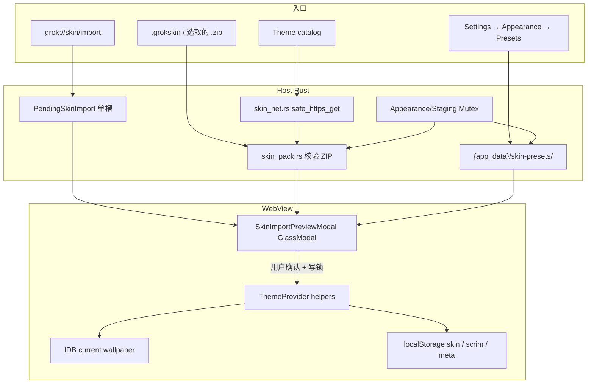
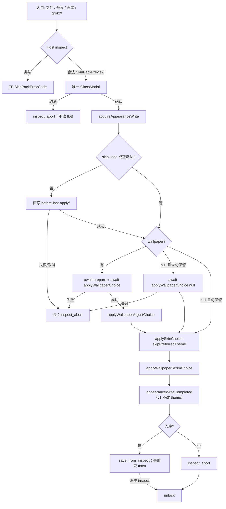
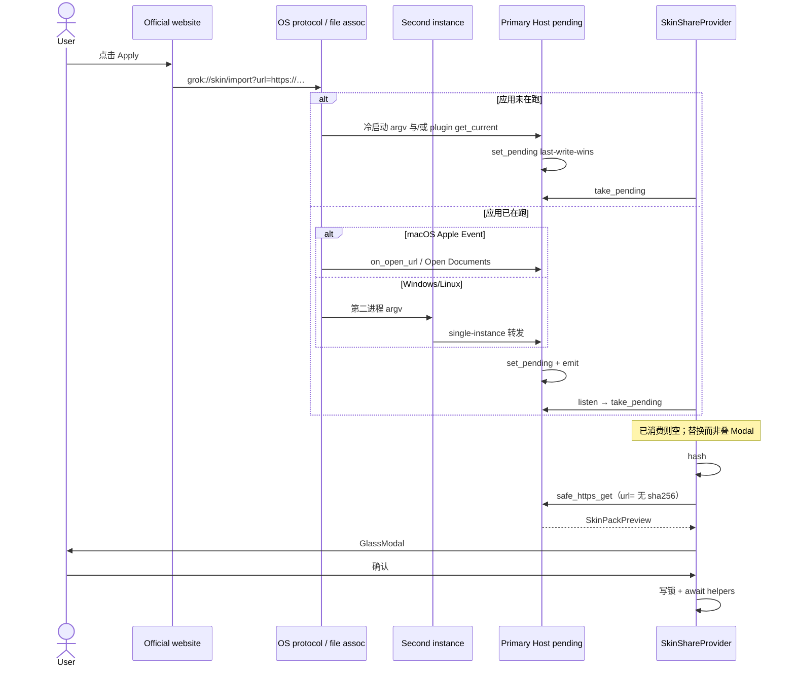
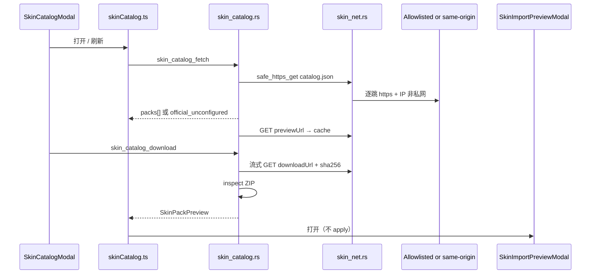

# 外观皮肤分享 / 预设导入导出 / 主题仓库 / 网站 Apply

| 字段 | 值 |
|------|----|
| **作者** | Grok App Design |
| **日期** | 2026-08-15 |
| **状态** | Approved（2026-08-15；产品三项决议已并入） |
| **范围** | 桌面端 Grok App（`com.grokapp.desktop`）；不实现官网前端 |
| **关联** | `src/lib/themeSkin.ts` · `src/providers/ThemeProvider.tsx` · `docs/llm-wiki/plugins-marketplace.md` · `docs/plans/2026-07-28-wallpaper-x-imagine-design.md` |

---

## Overview

用户可以把当前「看起来一样」的外观打成一份可分享文件：内置配色皮肤、壁纸字节、裁切/焦点、视频 clip、遮罩强度。接收方通过本地文件、主题仓库下载，或官网 **Apply** 拉起桌面端，经同一条确认流水线导入后得到同一套观感。

本设计把这份能力做成 **App 自有** 的皮肤包系统（不是 CLI plugin marketplace 的第二个商店）。包格式是带硬约束的 `.grokskin` ZIP；当前生效壁纸继续只活在 IndexedDB；本地预设落在 `{app_data}/skin-presets/`；目录与下载走 Host `reqwest` + 共用的 `safe_https_get`（复用 `proxy.rs`，**禁止**复用 `wallpaper_source::fetch_media`）；官网协议 `grok://` 与 `.grokskin` 文件关联只负责把意图写入唯一的 `PendingSkinImport` 槽，再交给「预览 + 确认」路径，**从不静默套用**。

---

## Background & Motivation

### 当前状态（已核对，不以本设计发明新的生效存储）

外观所有权在 `src/providers/ThemeProvider.tsx`，落地函数是：

- `applySkinChoice`（今日若 `skinPreferredTheme(next)` 非空会顺带 `applyThemeChoice`；全部内置皮肤为 `appearance: "auto"`，故当前无副作用）
- `applyWallpaperChoice`（async；失败只调 `onError` 然后 `return`）
- `applyWallpaperAdjustChoice`（localStorage 无 meta 时直接 `return`，丢 focus/clip）
- `applyWallpaperScrimChoice`

这些 helper **没有互斥**。`SettingsPage.tsx` 的 `wallpaperBusy` 只包住设置页自己的 `onWallpaperFile`，管不到深链 / 预设 Apply。

设置信息架构：`appearance` 分 `theme`（皮肤 + 壁纸）与 `interface`（聊天 chrome）。登记表在 `src/lib/settingsCatalog/entries/appearance.ts`。深链 `#/settings/appearance` → theme tab。UI 在 `src/components/settings/AppearanceSection.tsx`。

**皮肤**（`src/lib/themeSkin.ts`）：

- 仅内置 id：`default | rose | gothic | mist | ocean | ember`
- 写在 `<html data-skin>`；token 重映射在 `src/styles/skins.css`
- **禁止注入外来 CSS**；不改原生窗口 chrome（除可选 preferred appearance）
- 全部皮肤 `appearance: "auto"`：选皮肤 **不会** 切换浅/深色
- 持久化：`localStorage` 键 `grok-app.skin`

**壁纸**：

- Blob：IndexedDB `grok-app` / store `wallpaper` / key `current`
- Meta：`localStorage` `grok-app.wallpaper`（`kind`, `mime`, `name`, `createdAt`, `width`/`height`, 可选 `focus {cx, cy, zoom}`, 可选 `clip {start, end}` 秒）
- 遮罩：`grok-app.wallpaper-scrim`，整数 0–100，CSS 变量 `--wallpaper-scrim-opacity` 等
- Focus 是 **渲染时按窗口宽高比切片**，源文件永不重编码（`src/lib/wallpaperFocus.ts`）
- Clip 是片内 seek，源文件永不重编码（`src/lib/wallpaperClip.ts`）
- 上限：静图源 40 MiB，压成 JPEG 最长边 1920 / ~1.6 MiB IDB；gif 原样；视频 mp4/webm 原样，最大 200 MiB
- 接受：jpeg / png / webp / gif / mp4 / webm
- 磁盘库：`{app_data}/wallpapers/`（`src-tauri/src/wallpaper_source.rs`，X / Imagine / library）。**当前生效壁纸仍是 IDB**，v1 不迁移

**浅/深色偏好**（`src/lib/theme.ts`）：`system | light | dark` + 可选日程。今天不是皮肤的一部分。

**Interface tab**（字体、密度、时间戳、禅模式等）是个人无障碍 / chrome，不是「看起来一样」的分享面。

**协议 / 单实例（已核对）**：

- `src-tauri/Info.plist` 只有 `NSCameraUsageDescription` / `NSMicrophoneUsageDescription`，无 `CFBundleURLTypes`。
- `Cargo.toml` / 前端 `package.json` **没有** `tauri-plugin-deep-link`。
- `capabilities/default.json` 只有 `core:*` 与已装插件权限，无 deep-link。
- `tauri.macos.conf.json` 只管 Overlay 窗口 chrome，**不管** bundle / 协议。
- `tauri-plugin-single-instance` 对第二实例只处理 `--fire-due-schedules`，否则 `tray::show_main_window`，**不把 argv / URL 转给前端**。
- macOS 对已在跑的应用，URL / 双击文件走 Apple Event（`kAEGetURL` / `kAEOpenDocuments`），**经常不出现在第二进程 argv**。只改 single-instance 扫 argv 不够。

### 痛点

1. 无法保存 / 切换「整套外观」；换皮肤或换壁纸是分散操作。
2. 无法把配色 + 壁纸 + 裁切 + clip + 遮罩一次性交给别人。
3. 壁纸视频最大 200 MiB，JSON+base64 不适合做交换格式。
4. 没有官方/社区主题仓库；插件市场是 CLI 源，皮肤是 App 拥有物，不能塞进 `grok plugin`。
5. 没有自定义协议与文件关联；官网无法「一键套用」。热启动在 macOS 上尤其会丢。

### 最接近的既有模式

`docs/llm-wiki/plugins-marketplace.md`：可配置源、官方默认、浏览目录、**从不自动安装**、GlassModal 确认、约 6h 缓存（`src/lib/marketplaceCatalogCache.ts`）。皮肤目录复用这套 UX 纪律，但存储与网络必须是 App 第一方目录，而不是第二个 CLI plugin store。

命令层既有切片：领域逻辑在 `src-tauri/src/wallpaper_source.rs` 这类模块（`lib.rs` 里 `mod wallpaper_source`），Tauri 入口是 `commands/mod.rs` 的 `include!("misc_p1.rs")` 薄封装。IPC **命令名是 snake_case**（如 `wallpaper_fetch_media`），DTO 才 `rename_all = "camelCase"`。

---

## Goals & Non-Goals

### Goals

1. **保存当前外观**为本地预设，可应用 / 重命名 / 删除 / 再导出。
2. **导出 / 导入完整包**（`.grokskin`），覆盖：内置 `skin` id、壁纸资源、`focus`、`clip`、`scrim`。
3. **主题仓库**：Host 拉 `catalog.json`，用户挑包下载；校验 sha256 + 体积后再走同一条导入流水线。
4. **官网 Apply 契约**（本仓库只做桌面端）：`grok://` + `.grokskin` 文件关联；冷/热启动都进入预览确认，从不自动 apply。
5. 应用预设 **一次可撤销**（自动写 `before-last-apply` 槽）。
6. 遵守现有产品约束：i18n 三语、无 `window.confirm`、无原生 `<select>`、App.tsx growth freeze、新设置登记 `settingsCatalog`。

### Non-Goals（v1）

- 自由调色盘、用户 CSS、字体包、HTML/JS 皮肤。
- 把 Interface tab（字体 / 密度 / zen / 时间戳等）打进包。
- 把当前生效壁纸从 IDB 迁到磁盘。
- 从 App 内直接发布到官方仓库（导出文件即可；上架走网站 / CI，与插件一致）。
- 云同步、多设备账号皮肤、每日自动轮换。
- 在本仓库实现官网前端。
- 镜像客户端 / Remote IM 套用皮肤（桌面 Host only；`!isDesktopHost()` 时整卡隐藏）。
- 第二个 CLI plugin marketplace，或把皮肤写入 `~/.grok`。
- 实现 `schemaVersion: 2` 自定义 token（另案；v1 见字段表 fail-closed）。
- 把包 id 当本地目录名（入库总是新 UUID）。

---

## Key Decisions

| # | 决策 | 理由 |
|---|------|------|
| K1 | 交换格式用 **`.grokskin` ZIP**，不用 JSON+base64 | 视频上限 200 MiB；仓库已依赖 `zip` crate（deflate）。JSON 内嵌媒体既胀又难流式校验。 |
| K2 | v1 只导出 **内置 `ThemeSkinId`**，不导出 token / CSS | `data-skin` 模型明确禁止外来 CSS。未知 `skin` 字符串：壁纸/遮罩仍应用，皮肤回落 `default` + `warnings: ["unknown_skin"]`。**v2 自定义 token 是未来另案**，v1 **不**实现、不分支 `schemaVersion > 1`（见字段表：非 `1` → 整包 `unsupported_schema`）。 |
| K3 | **v1 永不写入、不应用 `themePreference`** | 浅/深色是接收方自己的 shell。App 导出 / 保存当前 **从不** 写该字段；保存对话框无勾选。确认框 **无**「同时切换浅/深色」。manifest 字段仍可选（前向兼容）；导入时 **忽略**（含第三方包里已有的值）。 |
| K4 | Interface tab **永不进包** | 无障碍与个人 chrome，不是外观包。 |
| K5 | 当前壁纸继续 **只活在 IDB**；预设在 `{app_data}/skin-presets/` | 与 `2026-07-28-wallpaper-x-imagine-design.md` 一致。删预设目录不影响正在用的壁纸。再导出读磁盘副本，不依赖 IDB。 |
| K6 | 应用预设必须走现有 ThemeProvider helpers | 单一写路径。皮肤分享调用 `applySkinChoice(id, { applyPreferredTheme: false })`。v1 **不**调用 `applyThemeChoice`（K3）。 |
| K7 | ZIP **拒绝未知顶层名**（fail-closed）；忽略一组已知垃圾名 | 比「忽略未知文件」更能挡住夹带 CSS/JS/HTML。`__MACOSX/`、`.DS_Store`、`._*` 是唯一白名单噪音。规范化后大小写不敏感匹配；重复名 `invalid_pack`；只接受 stored+deflate。 |
| K8 | 导入壁纸必须再跑 `prepareWallpaperFromFile` + 现有 mime/体积上限 | 恶意 2 GB「jpeg」不能进 IDB；假 mime / SVG / HTML 被挡在既有解码路径外。 |
| K9 | 主题目录是 **App 第一方 catalog**，不是 CLI marketplace | 皮肤不归 `grok plugin`。UX 对齐插件（不自动安装、6h 缓存、空态诚实），存储与网络独立。 |
| K10 | 目录与包下载 **只走 Host `safe_https_get` + `proxy.rs`** | `tauri.conf.json` CSP 很严；浏览器不得 `fetch` 任意目录主机。**禁止**复用 `wallpaper_source::fetch_media`（host allowlist + 不逐跳复核）。 |
| K11 | **用户附加源**的 `downloadUrl` / `previewUrl` 必须与该源 catalog **同 origin** | 防止被劫持的用户 `catalog.json` 把下载指到任意主机。官方源见 K19，**不是**同 origin。 |
| K12 | **从不自动 apply**（文件 / 仓库 / 深链同一条确认） | 对齐插件「never auto-install」。 |
| K13 | 每次**用户** Apply 前覆盖写 `before-last-apply`（`skipUndoSnapshot: false`） | 快照必须在释放外观写锁之前完成；快照失败则中止 Apply。用户撤销与自动回滚传 `skipUndoSnapshot: true`：只读已有槽，**禁止**再写入该目录。 |
| K14 | 协议 **`grok://`**（现用）+ 扩展名 `.grokskin`；唯一入口 `PendingSkinImport` | 产品选定 `grok://`。若与其它 xAI 客户端冲突，再迁 `grok-app://`，解析层 **双认**一段时间。插件 / argv / Apple Event / `RunEvent::Opened` 只写 pending。FE 只 `take_pending`。argv **不**猜 ZIP。 |
| K15 | 新 UI/状态进 `SkinShareProvider` + hooks/components/lib，**不往 `App.tsx` 加 `useState`** | App growth freeze。`App.tsx` 最多包一层 Provider（PR2）。现有 `shellEpoch` 不得借机膨胀。 |
| K16 | 从 App 发布到仓库 = **out of scope** | 导出 `.grokskin`；上架是网站/CI 的事。 |
| K17 | `OFFICIAL_SKIN_CATALOG_URL` **保持 `""`** 直至日后填入；官方不可删、可禁用；用户源 HTTPS-only，上限 5 | 先发本地预设 + 文件导入导出。官方 URL 是编译期常量，用户改不了。URL 为空期间隐藏官方浏览按钮；官网 Apply 只用 `url=`。 |
| K18 | 官网 **现阶段只传 `url=`**；`repo=official&id=` 待官方 URL 非空后再启用 | 官方 catalog 未上线前网站不得出 `repo=` 按钮。解析层仍认 `repo=official`，运行时 `official_unconfigured`。`url=` 无 sha256。拒绝非 https / 凭据 / 私网。 |
| K19 | 官方源使用 **编译期 origin allowlist**（不是同 origin） | 允许 catalog 在 GitHub Pages / 自有域，pack/preview 在 GitHub Releases CDN。列表见 D 节。用户源仍 K11 同 origin。 |
| K20 | `PendingSkinImport` **单槽 last-write-wins**；不排队 | 连点两次官网 Apply 只保留最后一次。listen 只是再 `take_pending`；已消费则空，禁止双开 Modal。 |
| K21 | **进程内单飞** Apply / Save / **upload** staging；inspect 与 upload **分目录** | FE 外观写锁与 `wallpaperBusy` 共用，避免 IDB split-brain。`.staging/inspect/{id}/` 给包抽出（`skin_pack_inspect` **不**走 `staging_begin`）。`.staging/upload/{id}/` 仅 IDB→磁盘分块。允许同时一份 inspect + 一份 upload；Host Mutex **只**禁止两次 `staging_begin` / 两个 upload。undo 快照**直接写** `before-last-apply/`，不占 upload 槽。Apply 结束（成功/失败/取消）必须 abort 未消费的 inspect。`index.json` tmp+rename。 |
| K22 | `url=` 与 catalog 共用 `safe_https_get`：逐跳 https / 无 userinfo / **解析后 IP** 非私网 | 含 v4-mapped、ULA `fc00::/7`、链路本地、`169.254.0.0/16`。最多 3 次重定向。 |
| K23 | 皮肤相关磁盘合计上限 **4 GiB**（含 undo + staging + catalog cache；**不含** IDB 当前壁纸） | 50×200 MiB 不可运维。保存/下载前 `statvfs` 预检；超限 `disk_budget`。Staging TTL 24h + 启动 GC。 |
| K24 | 纯皮肤包（`wallpaper == null`）默认 **清除** 接收方壁纸 | 「同一套外观」否则不成立。预览必须警告。本地文件导入额外提供默认关的「保留我的壁纸，只套用皮肤/遮罩」。 |
| K25 | 官方 URL 为空时：隐藏官方浏览按钮；`repo=official` → `official_unconfigured`；**绝不**回落用户源 | 已决议保持 `""` 直至日后填入。浏览可见按钮在 URL 填入前保持隐藏（卡片上仍留 `settings-anchor-skin-catalog` 占位）。管理源仍可添加用户源。 |
| K26 | 入库目录名 **总是新 UUID**；`sourceId` 仅供展示；`before-last-apply` 保留 | 避免 catalog slug 碰撞覆盖。用户预设不得占用保留名。 |

---

## Proposed Design

### 总览



职责切分：

| 层 | 做什么 | 不做什么 |
|----|--------|----------|
| Host `skin_pack.rs` | ZIP 读写、路径安全、hash、体积 | 不写 IDB、不改 `data-skin` |
| Host `skin_presets.rs` | 预设库、`index.json` 原子写、undo 槽 | 不自动 apply |
| Host `skin_catalog.rs` | 源、fetch、download、preview cache | 不自动 apply |
| Host `skin_net.rs` | `safe_https_get`（url= 与 catalog 共用） | 不调用 `wallpaper_source::fetch_media` |
| Host `skin_deeplink.rs` | 解析 `grok://` / `.grokskin` argv、pending 槽 | 不猜 ZIP、不直接改外观 |
| Host `skin_staging.rs` | 分块写入、TTL GC、单飞行 | 并行 begin |
| FE `SkinShareProvider` | 预览弹窗、`take_pending`、外观写锁、onError | 不把产品状态塞进 `App.tsx` |
| FE `ThemeProvider` | 确认后的唯一生效写路径 | 不解析 ZIP |

---

### A. Pack 格式 — `.grokskin` ZIP

#### 容器

- 扩展名 **`.grokskin`**（本质是 ZIP）。
- 写包时 ZIP comment 设为 `GROKSKIN/1`（可选魔数）。读包时 comment **不是**硬性条件——合法 `manifest.json` 的 `.zip` 也接受（**仅**设置里 `rfd` 选取；argv / 文件关联 / 深链 **不**认 `.zip`）。
- 压缩方法：**只接受** `Stored` 与 `Deflated`。bzip2 / zstd / 其它 → `invalid_pack`。
- 写出时：`manifest.json` / `preview.jpg` 用 deflate；壁纸媒体 **stored**。

#### 布局

```
manifest.json            # 必需，UTF-8，schemaVersion
assets/wallpaper.<ext>   # 可选，恰好一个媒体文件
preview.jpg              # 可选，静图预览
```

允许的 `ext`：`jpg` `jpeg` `png` `webp` `gif` `mp4` `webm`（与 `WALLPAPER_ACCEPT` 对齐）。

#### 条目名规范化

对每个 ZIP 条目名：

1. 把 `\` 换成 `/`（若规范化前同时存在未转义的 `..` 段或盘符 / UNC / 绝对路径 → `invalid_pack`，在替换前检测）。
2. 去掉前导 `./`。
3. Unicode 正规化后 **转小写** 再与允许表匹配（Windows 上 `Manifest.json` / `ASSETS/WALLPAPER.JPG` 视为合法对应名）。
4. 落盘时使用规范化后的规范名（`manifest.json`、`preview.jpg`、`assets/wallpaper.<ext>`），不用条目里的原始大小写。

**允许的条目名**（规范化之后）：

- `manifest.json`
- `preview.jpg`
- `assets/wallpaper.<ext>`
- 目录条目 `assets/`（可有可无）

**忽略**（不报错）：规范化后为 `__macosx/**`、`.ds_store`、`._*`、或以 `/` 结尾的空目录。

**重复名**：规范化后同一允许名出现两次 → `invalid_pack`（禁止后写覆盖 / zip-slip 变体）。

**其余一律拒绝**（`invalid_pack`）：`theme.css`、`*.js`、`*.html`、`*.svg`、第二个壁纸、`preview.png`、嵌套 ZIP、绝对路径、`..`。

#### ZIP 安全（对齐并严于 `fs_browser.rs`）

现有 `fs_browser.rs` 只按名字读条目、不落盘。皮肤包要抽到 `{app_data}/skin-presets/`，必须：

1. 拒绝盘符、UNC、绝对路径、`..`。
2. 规范化后做 `starts_with(dest_root)`（canonicalize 目标；每个写出文件再验一次）。
3. 拒绝符号链接 / 硬链接条目。
4. 拒绝加密 ZIP。
5. 条目数 ≤ 16。
6. ZIP 文件本身 ≤ **201 MiB**。
7. 未压缩合计 ≤ 201 MiB（防 zip bomb）。**不要**对媒体用压缩比启发式。
8. `manifest.json` 未压缩 ≤ 64 KiB。
9. `preview.jpg` 未压缩 ≤ 256 KiB。
10. 壁纸未压缩 ≤ `WALLPAPER_MAX_VIDEO_BYTES`（200 MiB）。
11. 抽到 **独立子目录**（`.staging/inspect/{inspectId}/` 或 `{uuid}/`），禁止写到 `wallpapers/`、`settings.json`、`secrets.json`、`.staging/upload/`。
12. 抽出前做 4 GiB 磁盘预算预检（K23）。

实现放 `src-tauri/src/skin_pack.rs`。单测至少覆盖：zip-slip、炸弹、额外文件、缺 manifest、**大小写别名**、**重复名**、**未知压缩方法**、`tokens`/`style`/`css` 字段。

#### `manifest.json`（camelCase，对齐现有壁纸 JSON）

```json
{
  "schemaVersion": 1,
  "id": "9f3c2e1a-7b84-4c21-9d0e-1a2b3c4d5e6f",
  "sourceId": "harbor-dusk",
  "name": "Harbor dusk",
  "description": "Ocean skin + clipped harbor loop",
  "author": "optional",
  "createdAt": 1776124800000,
  "skin": "ocean",
  "scrim": 42,
  "wallpaper": {
    "file": "assets/wallpaper.mp4",
    "kind": "video",
    "mime": "video/mp4",
    "name": "harbor.mp4",
    "width": 1920,
    "height": 1080,
    "sha256": "…64 hex…",
    "focus": { "cx": 0.46, "cy": 0.38, "zoom": 1.25 },
    "clip": { "start": 3.2, "end": 11.0 }
  }
}
```

字段契约：

| 字段 | 规则 |
|------|------|
| `schemaVersion` | 必须是整数 `1`。缺失 / `>1` / `0` → `unsupported_schema`（整包失败）。v1 **不**实现 v2 分支。 |
| `id` | 包内标识（UUID 或 slug `[a-z0-9-]{1,64}`）。非法则忽略。**入库不使用此字段当目录名**。 |
| `sourceId` | 可选。导入/下载入库时由 Host 写入：原包 `id` 或 catalog `id`，仅供 UI 展示。 |
| `name` | 必需，trim 后 1–80 字素，去掉控制字符。 |
| `description` | 可选，≤ 500。 |
| `author` | 可选，≤ 80。 |
| `createdAt` | epoch ms；非法则用导入时刻。 |
| `skin` | 字符串。未知 id **不**导致整包失败：回落 `default`，preview DTO 带 `warnings: ["unknown_skin"]`。 |
| `scrim` | 整数 0–100；缺省 / 非法 → `DEFAULT_WALLPAPER_SCRIM`（100）。 |
| `themePreference` | 可选 `"light" \| "dark" \| "system"`，**仅前向兼容**。App **导出 / 保存永不写入**。导入 **忽略**（不改接收方浅/深色，确认框不展示）。非法值忽略。 |
| `wallpaper` | `null` 或省略 = 纯皮肤包。默认 Apply **清掉** 当前壁纸（K24）。 |
| `wallpaper.file` | 必须是 `assets/wallpaper.<ext>`，且 ZIP 内存在。 |
| `wallpaper.kind` / `mime` | 必须与 ext 一致；只允许现有壁纸 mime。`image/svg+xml`、`text/html` 拒绝。 |
| `wallpaper.sha256` | 壁纸字节的 SHA-256 hex（小写）。不匹配 → `hash_mismatch`。 |
| `focus` | 走 `normalizeWallpaperFocus`；默认焦点可省略。`zoom` clamp 到 `[1, 5]`。 |
| `clip` | 仅 `kind === "video"` 有意义；走 `parseWallpaperClip`。静图上的 clip 忽略。 |
| `tokens` / `style` / `css` | 任一出现 → `unsupported_schema`（整包失败）。 |
| 其它未知字段 | v1 **忽略**（与 catalog 一致），便于向前加纯数据字段。 |

无壁纸时不得存在 `assets/wallpaper.*`。有壁纸声明但缺文件 → `invalid_pack`。

#### 「同一套外观」的诚实边界

- `focus` 按 **接收方当前窗口宽高比** 切片。换显示器比例，焦点仍在同一媒体坐标，可见范围会变。
- 静图可能二次 JPEG。gif / 视频原样，导入端只做 mime/体积/探测。
- 不捕获 native chrome、字体、密度、zen。
- 纯皮肤包会清壁纸（K24）；预览必须写明。

#### 预览图

- 仅 `preview.jpg`。最长边 640，≤ 256 KiB。
- 导出时 Host 生成：静图 / gif 首帧直接用 `image` crate（**不要**走 `media_image_thumb` / `image_thumb.rs` 的 12 MiB 聊天缩图路径）；视频用 `video_poster.rs`（ffmpeg，软失败则省略预览）。
- 导入时只当 `` 预览，**绝不**当壁纸源。解码失败则丢掉预览，用皮肤 swatch 兜底。

#### 导出文件名

`sanitize(name)`：保留 `[A-Za-z0-9._-]`，空白改 `-`，折叠重复 `-`，截断 60，空则 `skin` → `{name}.grokskin`。

---

### B. 本地预设

#### 磁盘

```
{app_data}/skin-presets/
  index.json
  sources.json                 # 仓库源（见 D）
  .staging/
    inspect/{inspectId}/       # 包抽出；TTL 24h；不算 staging_begin
    upload/{uploadId}/         # 仅 IDB→磁盘分块；TTL 24h
  before-last-apply/           # 保留撤销槽；undo 快照直接写入此处
    manifest.json
    assets/…
    preview.jpg
  {uuid}/                      # 总是新 UUID，不是包 id
    manifest.json
    assets/wallpaper.<ext>?
    preview.jpg
```

`paths::ensure_app_dirs` 增加 `skin-presets/.staging/inspect/` 与 `skin-presets/.staging/upload/`，并在启动时 GC 两棵树里过期目录。`path_scope` 已把整个 `app_data_root` 算进允许根。

`index.json`（**原子写**：写 `index.json.tmp` + `rename`；读到半截则视为损坏并重建为「扫描子目录」的降级列表）：

```json
{
  "schemaVersion": 1,
  "presets": [
    {
      "id": "9f3c2e1a-7b84-4c21-9d0e-1a2b3c4d5e6f",
      "sourceId": "harbor-dusk",
      "name": "Harbor dusk",
      "description": "",
      "author": "",
      "createdAt": 0,
      "updatedAt": 0,
      "skin": "ocean",
      "scrim": 42,
      "hasWallpaper": true,
      "kind": "video",
      "bytes": 18432000,
      "previewRel": "preview.jpg"
    }
  ]
}
```

- 用户预设上限 **50**（`before-last-apply` 不计入条数，但 **计入 4 GiB 磁盘预算**）。超条数 → `preset_limit`。超磁盘 → `disk_budget`。
- `before-last-apply` 是保留 id / 目录名。用户 `skin_preset_rename` / 入库若撞此名 → `invalid_pack` / `not_found`，不得覆盖撤销槽。
- UI 展示每条 `bytes` 与合计占用（预设 + undo + staging + catalog cache）。
- `reset_app_data` 删除 `skin-presets/`（含 staging）与 `skin-catalog-cache/`。不碰 IDB 当前壁纸，也不删 `{app_data}/wallpapers/`（与今天一致）。

#### 磁盘预算（K23）

计入 **4 GiB** 的路径：

- `{app_data}/skin-presets/`（含 `before-last-apply/`、`.staging/`、用户 `{uuid}/`、`index.json`、`sources.json`）
- `{app_data}/skin-catalog-cache/`

**不计入**：IDB 当前壁纸、`{app_data}/wallpapers/`（X / Imagine 库）。

保存 / 下载 / inspect 抽出 / 写 undo 之前：

1. 累加将新增的字节。
2. `statvfs`（或平台等价）确认卷上剩余空间 ≥ 新增字节 + **256 MiB** 余量。
3. 合计将超过 4 GiB 或卷空间不足 → `disk_budget`，不写盘。

Staging TTL **24h**（按目录 mtime）。启动与 `ensure_app_dirs` 扫掉过期 staging。崩溃残留不会靠用户点 Doctor 才消失。

#### Staging 两类目录（K21）

| 槽 | 路径 | 谁创建 | Mutex |
|----|------|--------|--------|
| **inspect** | `.staging/inspect/{inspectId}/` | `skin_pack_inspect`（及 catalog 下载后的 inspect） | **不**走 `staging_begin`。同时最多一份 inspect；新 inspect 先 abort 旧的。可与一份 upload **并存**。 |
| **upload** | `.staging/upload/{uploadId}/` | 仅 `skin_staging_begin`（保存当前 / 导出当前：IDB→磁盘分块） | Host upload Mutex：**只**禁止第二次 `staging_begin`。与 inspect 不互斥。 |
| **undo** | `before-last-apply/` | `snapshotBeforeLastApply` **直接写入**该目录 | **不**占 upload 槽，**不**调用 `staging_begin`。与 inspect 并存（这是 Apply 主路径）。 |

Apply 结束（成功、失败、取消、关预览）必须 abort **未消费**的 inspect 目录。入库成功则由 save **消费** inspect（move/copy 到 `{uuid}/` 后删 inspect），不再 abort。

#### Save current / upload 生命周期

「保存当前」快照：`skin` + `scrim` + IDB 壁纸 blob + `focus`/`clip` + 用户命名。无壁纸则跳过分块。

大视频不能一次 IPC 200 MiB base64。使用 **upload 分块**（与 inspect 无关）：

1. `skin_staging_begin` → `{ uploadId }`。Host **只允许一个** in-flight **upload**；第二次 begin → `busy`。inspect 占用中 **不**导致 busy。
2. FE 从 IDB 读 blob，512 KiB 块 `skin_staging_append`（块为原始字节的 base64，**同时只持有一块**）。
3. Host 写 `.staging/upload/{uploadId}/`，合计上限 200 MiB，计入 4 GiB。
4. `skin_preset_save_from_upload` / `skin_pack_export` 消费后删除该 upload 目录。
5. 用户取消、TTL 到期 → `skin_staging_abort`（只删 upload，不动 inspect）。

#### Undo 快照（直接写 `before-last-apply/`）

用户 Apply（`skipUndoSnapshot === false`）且当前不是空默认时：把当前外观 **直接** 写入 `before-last-apply/`（有壁纸则从 IDB 分块写到该目录的 `assets/`，**不**经过 `.staging/upload/`）。当前无壁纸则只写 manifest。大视频时 Modal 显示「正在保存撤销副本…」进度，可取消（`cancelled`）；取消则不改生效外观、不覆盖半成品槽（写到旁路临时目录再 rename 进 `before-last-apply/`，失败则丢掉临时目录）。

用户点「撤销上次应用」与自动回滚：**只读**已有 `before-last-apply/`，`skipUndoSnapshot: true`，禁止任何写入该目录（包括 `staging_begin`）。

#### 空默认谓词

```ts
function isEmptyDefaultLook(s: {
  skin: ThemeSkinId;
  wallpaperRecord: WallpaperRecord | null;
  wallpaperScrim: number;
}): boolean {
  return (
    s.skin === "default" &&
    s.wallpaperRecord == null &&
    parseWallpaperScrim(s.wallpaperScrim) === DEFAULT_WALLPAPER_SCRIM
  );
}
```

**不含** `themePreference` / 日程。空默认不写 `before-last-apply`（无可撤销内容）。

#### Apply 单飞与失败语义（K21 / K6）

进程内外观写锁：

- FE：`src/lib/appearanceWriteLock.ts` — 单飞 Promise mutex + `busy` 订阅。`SkinShareProvider` 与 `SettingsPage` 的壁纸上传 / `WallpaperSourceModal` / focus 编辑 **共用** 这把锁。`wallpaperBusy || appearanceBusy` 时禁用壁纸按钮与预设 Apply/Save。
- Host：**upload Mutex** 只覆盖 `skin_staging_begin`（第二次 begin → `busy`）。另有 `index.json` 写锁。inspect 抽出与 undo 直写 `before-last-apply/` **不**拿 upload Mutex。

Apply 必须在外观写锁内完成：需要快照时 **先** 直写 `before-last-apply/`，成功后才改 IDB。用户在锁持有期间不能改壁纸。

**外观 helpers 全部跑完 = Apply 成功。** 之后的 `saveToLibrary` 失败只 toast（`disk_budget` / `preset_limit` 等），**不**回滚已套用的外观。

失败 / 回滚：

| 阶段 | 已发生的变更 | 行为 |
|------|----------------|------|
| undo 快照失败 / 取消（且未 `skipUndoSnapshot`） | 无 | 停；诚实码 `cancelled` 或 `disk_budget`；**不**继续 Apply |
| `prepareWallpaperFromFile` 失败 | 无生效变更 | 停；不调任何 apply* |
| `applyWallpaperChoice` 失败（`onError`） | IDB 应未改 | 停后续 helper；不回滚 |
| 壁纸已写入之后、`appearanceWriteCompleted` 之前，skin / scrim / adjust 抛错 | IDB 已变 | 若 `undoSnapshotCompleted`：自动回滚（`skipUndoSnapshot: true`）；toast 已恢复 |
| 快照因空默认跳过或 `skipUndoSnapshot`，且壁纸已写入后、外观写完前失败 | 无法安全回滚 | 停后续；诚实错误；不假装撤销 |
| 皮肤/遮罩已写入之后（含 `saveToLibrary` 失败） | 外观已是目标 | **不回滚**；入库失败只 toast。v1 不写 theme |

自动回滚与用户撤销都走 `applyPack(..., { skipUndoSnapshot: true })`，只读已有槽。

#### Apply 伪代码（SkinShareProvider 写死）

```ts
async function applyPack(
  preview: SkinPackPreview,
  opts: {
    keepWallpaper: boolean;      // 仅本地文件 + wallpaper==null
    saveToLibrary: boolean;
    skipUndoSnapshot: boolean;   // 用户撤销 / 自动回滚 = true
  },
): Promise<void> {
  const unlock = await acquireAppearanceWrite();
  let undoSnapshotCompleted = false;
  let wallpaperAlreadyMutated = false;
  let appearanceWriteCompleted = false;
  let savedToLibrary = false;
  try {
    const needClearWallpaper =
      preview.wallpaper == null && !opts.keepWallpaper;

    if (!opts.skipUndoSnapshot && !isEmptyDefaultLook(currentLook())) {
      // 直写 before-last-apply/，不调用 staging_begin
      const snap = await snapshotBeforeLastApply({ onProgress, onCancel });
      if (!snap.ok) {
        showSkinPackError(snap.code);
        return;
      }
      undoSnapshotCompleted = true;
    }

    if (preview.wallpaper) {
      const file = await fileFromAbsolutePath(preview.wallpaper.path, {
        name: preview.wallpaper.name,
        mime: preview.wallpaper.mime,
      });
      const record = await prepareWallpaperFromFile(file);
      const wallOk = await applyWallpaperChoiceAwait(record);
      if (!wallOk) return;
      wallpaperAlreadyMutated = true;
      applyWallpaperAdjustChoice({
        focus: preview.wallpaper.focus ?? DEFAULT_WALLPAPER_FOCUS,
        clip: preview.wallpaper.clip ?? null,
      });
    } else if (needClearWallpaper) {
      const wallOk = await applyWallpaperChoiceAwait(null);
      if (!wallOk) return;
      wallpaperAlreadyMutated = true;
    }

    applySkinChoice(preview.skin, { applyPreferredTheme: false });
    applyWallpaperScrimChoice(preview.scrim);
    // v1：忽略 preview.themePreference，不调用 applyThemeChoice（K3）
    appearanceWriteCompleted = true; // Apply 成功；此后不得因入库失败回滚

    if (opts.saveToLibrary) {
      try {
        await skin_preset_save_from_inspect({ inspectId: preview.id });
        savedToLibrary = true; // save 消费 inspect 目录
      } catch (saveErr) {
        showSkinPackError(codeFrom(saveErr)); // 只 toast
      }
    }
  } catch (e) {
    if (
      wallpaperAlreadyMutated &&
      undoSnapshotCompleted &&
      !appearanceWriteCompleted
    ) {
      // 已持有外观写锁：走内部回滚，禁止再 acquire / 禁止写 before-last-apply
      await rollbackFromBeforeLastApplyUnlocked();
    }
    if (!appearanceWriteCompleted) {
      showSkinPackError(codeFrom(e));
    }
  } finally {
    if (!savedToLibrary) {
      await skin_inspect_abort({ inspectId: preview.id });
    }
    unlock();
  }
}

function applyWallpaperChoiceAwait(record: WallpaperRecord | null) {
  return new Promise<boolean>((resolve) => {
    void applyWallpaperChoice(record, {
      onError: (msg) => {
        showSkinPackError(mapThemeProviderError(msg));
        resolve(false);
      },
    }).then(() => resolve(true));
  });
}
```

要点：

- **必须 await** 壁纸写完再 `applyWallpaperAdjustChoice`。
- v1 **不**应用 `themePreference`，**不**调用 `applyThemeChoice`。`applySkinChoice(..., { applyPreferredTheme: false })`。
- `onError` / i18n 由 `SkinShareProvider` 自管。
- 用户撤销：`applyPack(materializeBeforeLastApply(), { skipUndoSnapshot: true, saveToLibrary: false, ... })`，**禁止** `staging_begin` 写 `before-last-apply/`。
- `fileFromAbsolutePath` 的 JS Heap 成本是既有路径；外观写锁避免与设置页上传重叠。inspect 与 upload 可并存，因此「inspect 抽出 + undo 直写」不再 `busy`。

#### Undo

存在 `before-last-apply` 时卡片显示「撤销上次应用」。用户再 Apply（非撤销）会覆盖该槽。撤销本身 **`skipUndoSnapshot: true`，不再覆盖**。撤销仍走预览（文案标明这是撤销）+ 写锁。

---

### C. 导入 / 导出 UX

#### 设置位置

**设置 → 外观 → 主题**，在皮肤网格与壁纸卡片 **下方**：

- 组件：`src/components/settings/SkinPresetsCard.tsx`
- **`!isDesktopHost()` 时整卡不渲染**（镜像 / 非桌面）。
- 自己 `useThemeShell()` + `useSkinShare()`，**不**给 `SettingsPageProps` / `AppWorkbench` 加新字段。

`AppearanceSection.tsx` 只在 theme tab 挂载该卡片。

#### 可见锚点（settings IA）

三个锚点都做在 **卡片上已渲染的控件**，Modal 内部不得占用 catalog 锚点（否则未打开 Modal 时 `scrollIntoView` 失败）：

| catalog id | `anchorId` | DOM |
|------------|------------|-----|
| `appearance.skinPresets` | `settings-anchor-skin-presets` | 卡片根 |
| `appearance.skinCatalog` | `settings-anchor-skin-catalog` | 「浏览仓库」按钮；按钮隐藏时仍在卡片上保留 **同一 id** 的标题或 visually-hidden 元素（见下） |
| `appearance.skinSources` | `settings-anchor-skin-sources` | 「管理源」按钮（始终可见于桌面卡片） |

三条 `anchorId` **静态、互不相同**，与 `APPEARANCE_ENTRIES` 写死一致。`catalogInvariants()` 禁止重复锚点——**禁止**运行时把 catalog 锚点改指源管理。

浏览按钮按 K25 隐藏时：卡片上仍渲染带 `id="settings-anchor-skin-catalog"` 的节点（区块小标题，或 `visually-hidden` / `sr-only` 的占位），保证搜索 / `scrollIntoView` 与 registry 对齐。Modal 内部不得占用这三个 id。

`labelKey` / `descKeys` / `keywords` 的三语键必须先存在于 en/zh/zh-TW，再登记，否则 `MessageKey` 与 `messages.test.ts` 会红。

**浏览仓库按钮**：`OFFICIAL_SKIN_CATALOG_URL === ""` 期间 **始终隐藏官方浏览可见按钮**（K17 / K25；已决议保持空串直至日后填入）。卡片上仍保留 `settings-anchor-skin-catalog` 占位。管理源仍可见（用户附加源）。官方 URL 填入后才显示官方浏览。

#### 操作

| 操作 | 行为 |
|------|------|
| 保存当前 | GlassModal 输入名称 → staging → 写入库（新 UUID） |
| 导入文件 | Host `rfd`：过滤器 `.grokskin`，同时接受 `.zip` → inspect → 预览确认 |
| 导出当前（不入库） | 可选命名 → staging → `rfd` 保存 |
| 行内应用 | 预览确认 → Apply |
| 行内导出 | 预设目录打成 zip → 保存对话框 |
| 行内删除 | GlassModal 确认后删目录 + 原子更新 index |
| 行内重命名 | GlassModal 输入 |
| 浏览仓库 | 打开 `SkinCatalogModal`（按钮可见时） |
| 管理源 | GlassModal 列表；加源须确认 hostname |
| 撤销上次应用 | 预览 `before-last-apply` |

`rfd` 必须 `spawn_blocking`（`commands/fs.rs`）。新命令 `skin_pick_open` / `skin_pick_save`。不要复用 `pick_attach_files`。选中的文件 `grant_path` **该文件本身**。

#### 预览确认（所有 Apply 入口共用）

`SkinImportPreviewModal`（`GlassModal`，同时只允许一个）：

- 皮肤 swatch + 本地化皮肤名
- `preview.jpg`，否则壁纸 thumb，再否则纯色
- 遮罩百分比
- 「含视频」徽章 + 体积
- `focus` / `clip` 摘要
- `warnings` 横幅：`unknown_skin`（将用 Default）、`will_clear_wallpaper`（见下）
- v1 **无**「同时切换浅色/深色」复选框（K3；即使包内带 `themePreference` 也忽略）
- 仓库下载：复选框「同时保存到本地预设」（**默认开**）
- 本地文件导入：同一复选框 **默认关**
- **当 `wallpaper == null` 且接收方当前有壁纸**：警告色文案「将移除你当前的背景（含视频）」。本地文件导入额外提供默认 **关** 的复选框「保留我的壁纸，只套用皮肤/遮罩」（K24）。仓库 / 深链 / 行内预设 Apply **不**提供该复选框（套用即同一套外观，含清壁纸）。
- 大视频 undo 快照：进度条 + 取消
- 主按钮 **应用**；次按钮取消（取消必须 `skin_inspect_abort`，不碰 upload）

**从不静默覆盖。**

#### i18n

新键前缀：`settings.skinPresets.*`、`settings.skinCatalog.*`、`settings.skinPack.err.*`、`settings.skinPack.warn.*`。en + zh + zh-TW。

**不要**复用 `settings.wallpaper.err.too_large`（文案仍写「最大 12 MB」，与 `WALLPAPER_MAX_SOURCE_BYTES = 40 MiB` 不一致）。皮肤包自备：

- `settings.skinPack.err.too_large` — 静图源最大 40 MB / 视频最大 200 MB（按 kind 分或一条说清两者）
- `settings.skinPack.err.disk_budget`
- `settings.skinPack.err.official_unconfigured`
- `settings.skinPack.err.source_disabled`
- `settings.skinPack.err.busy`
- `settings.skinPack.warn.unknown_skin`
- `settings.skinPack.warn.will_clear_wallpaper`

---

### D. 主题仓库（应用内下载）

#### 源模型

```ts
// src/lib/skinCatalog.ts — 与 Rust 常量必须一致
export const OFFICIAL_SKIN_CATALOG_ID = "official";
/** 已决议保持空串直至日后填入。空 = 官方源未配置，隐藏官方浏览，不发明目录行。 */
export const OFFICIAL_SKIN_CATALOG_URL = "";

/**
 * 官方 catalog / pack / preview 允许的 host。
 * 精确匹配或「host == e 或 host.endsWith('.'+e)」。
 * 拓扑已定：catalog 可在 Pages / 自有域；pack 可在 GitHub Releases CDN。
 */
export const OFFICIAL_SKIN_DOWNLOAD_ORIGINS = [
  "github.com",
  "github.io",
  "githubusercontent.com",
  "release-assets.githubusercontent.com",
  "objects.githubusercontent.com",
  "x.ai",
] as const;
```

`OFFICIAL_SKIN_CATALOG_URL` 非空时，其自身 origin 自动并入允许集。

空 URL 是 **当前发货态**（K17）：官方浏览按钮隐藏；`repo=official` → `official_unconfigured`（K25）；官网 Apply 只用 `url=`。

`{app_data}/skin-presets/sources.json`：官方 `url` **永远**被常量覆盖。官方不可删、可禁用。用户源仅 https、上限 5、加源须确认 hostname。拒绝：非 https、userinfo、私网/回环/链路本地/元数据 IP。

#### 官方 vs 用户源的 origin 规则（K11 / K19）

| 源 | catalog 自身 | `downloadUrl` / `previewUrl` / 每一跳 redirect |
|----|----------------|--------------------------------------------------|
| `official` | URL 必须 https 且 host ∈ allowlist（或 URL 为空） | host ∈ **同一份** compile-time allowlist；不必与 catalog 同 origin |
| 用户附加源 | 用户确认过的 https catalog | **必须与该 catalog 同 origin**（scheme+host+port）；禁止指向 Releases 而 catalog 在 raw.githubusercontent.com |

这样 GitHub Pages（`*.github.io`）上的 `catalog.json` + Releases 资产（`release-assets.githubusercontent.com` / `objects.githubusercontent.com` / `github.com`）是 **一等支持的官方拓扑**，不是未解释的 Open Question。用户源仍 fail-closed 同 origin，避免「用户加一个 Pages catalog、条目指向任意 CDN」。

#### `catalog.json`

体积必须小（无媒体）：

```json
{
  "schemaVersion": 1,
  "updatedAt": 1776124800000,
  "packs": [
    {
      "id": "harbor-dusk",
      "name": "Harbor dusk",
      "description": "…",
      "author": "…",
      "previewUrl": "https://release-assets.githubusercontent.com/…/harbor.jpg",
      "downloadUrl": "https://github.com/org/repo/releases/download/…/harbor.grokskin",
      "sha256": "…64 hex of the grokskin bytes…",
      "bytes": 18435000,
      "skin": "ocean",
      "hasWallpaper": true,
      "kind": "video",
      "tags": ["ocean", "video"]
    }
  ]
}
```

| 规则 | 值 |
|------|-----|
| JSON 体 | ≤ 512 KiB |
| `packs.length` | ≤ 200 |
| 每条 `id` | 非空，库内唯一 |
| `sha256` / `bytes` | 必需；`bytes` ∈ (0, 201 MiB] |
| URL | https；官方走 allowlist，用户源走同 origin |
| 重定向 | 最多 3 次；每跳再跑 `safe_https_get` 规则 |
| 未知字段 | 忽略；`schemaVersion !== 1` → 整份目录失败 |

缓存：`{app_data}/skin-catalog-cache/{sourceId}/`，TTL 6h，计入 4 GiB。预览 Host 下载（≤ 256 KiB），FE 用 loopback。刷新按钮强制重拉。

浏览 UI：`SkinCatalogModal`。空态：加载中、离线、坏 URL、**官方未配置**、源已禁用、无已启用源、目录为空、过滤无结果。Host 失败时 **不**发明行。

下载：`safe_https_get` 流式写入临时文件 → sha256 必须匹配 → `skin_pack_inspect` 抽到 `.staging/inspect/{id}/`（**不**走 `staging_begin`）→ 同一预览 Modal。**不自动 apply。**

`user-agent` 用应用名。timeout 60s。`proxy::apply_to_reqwest`。

---

### E. 官网 Apply → 应用导入

本仓库只做桌面契约。网站以后按本节接线。

#### 唯一 pending 入口（K14 / K20）

```ts
type PendingSkinImport =
  | { kind: "url"; href: string }       // 已通过解析的 https pack URL
  | { kind: "file"; path: string }      // 绝对路径，后缀 .grokskin
  | { kind: "official"; id: string };   // repo=official&id=
```

Host 持有 `Mutex<Option<PendingSkinImport>>`。**last-write-wins**。不排队。

FE **只**调用 `skin_import_take_pending`（取出并清空）。`listen("skin://import-pending")` 也只是再 take 一次；`null` 则不开 Modal。Modal 已打开时用新 preview **替换**内容，禁止叠两个 `GlassModal`。

FE **不**调用 `@tauri-apps/plugin-deep-link` 的 `getCurrent` / JS `onOpenUrl` 来开 Modal（避免与 Host pending 双开）。插件只在 **Rust** 侧注册，回写 pending。

#### 事件 → 解析 → pending

| 时机 | 平台 | 事件 | 解析 | 写入 pending | 其它 |
|------|------|------|------|--------------|------|
| 冷启动 | 全平台 | `std::env::args()` | 只认 `grok:` URL 与路径后缀 `.grokskin`（大小写不敏感）。**不**猜 ZIP / 魔数 | 每个匹配覆盖槽 | **不够单独覆盖 macOS 文件打开**；必须再收 `RunEvent::Opened` |
| 冷启动 | 全平台 | 插件 `get_current()`（Host `setup` 里调一次） | 只认 `grok:` | 写入（可覆盖 argv 已写的同一意图，允许） | FE 不调 JS getCurrent |
| 冷启动 + 热启动 | macOS（及其它投递 `Opened` 的平台） | 现有 `lib.rs` `.run(\|app, event\|)` 增加 `RunEvent::Opened { urls }` | `file:` 且后缀 `.grokskin` → `{ kind: "file", path }`；`grok:` → 与 `on_open_url` 同一解析 | `skin_deeplink::set_pending`（与 `on_open_url` **同一函数**）+ emit | 冷启动在 `setup` **之后**由 run loop 收 `Opened`，不要只信 argv。非 `.grokskin` 的 `file:` 忽略 |
| 热启动 | macOS | Apple Event `kAEGetURL` → 插件 Rust `on_open_url` | `grok:` | 覆盖 + emit `skin://import-pending` | **不要**再扫一份 argv |
| 热启动 | Windows / Linux | 第二实例 argv → `single-instance` 回调 | `grok:` 或 `*.grokskin` | 覆盖 + emit | 然后 `tray::show_main_window` |
| 热启动 | 全平台 | 插件 `on_open_url`（若 OS 把协议交给已运行进程） | `grok:` | 覆盖 + emit | 与 argv / `Opened` 去重：只注册一处 `set_pending` |
| 任意 | 全平台 | argv 含 `--fire-due-schedules` | **不解析皮肤** | **不写 pending、不 emit、不 show_main_window** | 保持现有 oneshot；**先**匹配 fire-due |

argv / 文件关联 **永不**把「看起来像 ZIP」的无后缀文件当皮肤包。设置里用户显式选 `.zip` 是另一条路径（`skin_pick_open`）。

#### `--fire-due-schedules` 优先序（手工 + 单测清单）

1. 第二实例 argv 同时带 fire-due 与 `grok://…` → **只**走 fire-due，丢皮肤（oneshot 不应抢外观）。
2. 主进程正在 Apply 皮肤时收到 fire-due → 现有 automation 路径不受外观写锁影响（不共用 Mutex）。
3. 回归：只带 fire-due 的第二实例仍不 focus 主窗。
4. 回归：只带 `.grokskin` 的第二实例 focus 主窗并打开预览。

#### 平台清单片段

`tauri.conf.json`（bundle 在此；**不要**写进 `tauri.macos.conf.json`）：

```json
{
  "bundle": {
    "fileAssociations": [
      {
        "ext": ["grokskin"],
        "name": "Grok Skin Pack",
        "description": "Grok appearance skin pack",
        "role": "Editor",
        "mimeType": "application/vnd.grok.skin"
      }
    ]
  },
  "plugins": {
    "deep-link": {
      "desktop": { "schemes": ["grok"] }
    }
  }
}
```

`src-tauri/Info.plist` **合并**（保留现有相机/麦克风文案）：

```xml
<key>CFBundleURLTypes</key>
<array>
  <dict>
    <key>CFBundleURLName</key>
    <string>com.grokapp.desktop.skin</string>
    <key>CFBundleURLSchemes</key>
    <array><string>grok</string></array>
  </dict>
</array>
<key>CFBundleDocumentTypes</key>
<array>
  <dict>
    <key>CFBundleTypeName</key>
    <string>Grok Skin Pack</string>
    <key>CFBundleTypeRole</key>
    <string>Editor</string>
    <key>LSHandlerRank</key>
    <string>Owner</string>
    <key>CFBundleTypeExtensions</key>
    <array><string>grokskin</string></array>
    <key>CFBundleTypeMIMETypes</key>
    <array><string>application/vnd.grok.skin</string></array>
  </dict>
</array>
```

Windows（NSIS `installMode: currentUser` → **HKCU**）：

- 协议：`HKCU\Software\Classes\grok\shell\open\command` = `"<exe>" "%1"`
- 文件：`HKCU\Software\Classes\.grokskin` → ProgID `Grok.SkinPack`；`Grok.SkinPack\shell\open\command` 同上
- 更新安装：in-app updater 换 exe 后 NSIS/覆盖安装应重写这些键；PR4 验收清单含「更新后再双击 `.grokskin`」

Linux `.desktop`：

```
MimeType=x-scheme-handler/grok;application/vnd.grok.skin;
```

AppImage 注册弱：官网必须提供下载 `.grokskin` 兜底。

#### 依赖与 ACL（PR4a 必改）

| 层 | 变更 |
|----|------|
| `src-tauri/Cargo.toml` | `tauri-plugin-deep-link = "2"` |
| 前端 `package.json` | `@tauri-apps/plugin-deep-link`（Rust 用；FE 可不直接调 JS API） |
| `capabilities/default.json` | 增加插件权限（以插件生成的 allowlist 为准，通常 `deep-link:default`） |
| `src-tauri/src/lib.rs` | `.plugin(tauri_plugin_deep_link::init())`；`setup` 里 `get_current` + `on_open_url` → `set_pending`；改 single-instance 回调 |
| `generate_handler!` | `skin_import_take_pending` 等（见 API） |

#### URL 形状与解析

实现：`src/lib/skinImportUrl.ts` + Rust `skin_deeplink.rs`，**共享** `src/lib/skinImportUrl.fixtures.json`。

```
grok://skin/import?url=https%3A%2F%2Fskins.example%2Fpacks%2Fharbor.grokskin
grok://skin/import?repo=official&id=harbor-dusk
```

规则（按序）：

1. 整段 URI ≤ 2048（含 scheme）。超长拒绝。
2. scheme 必须是 `grok`（大小写不敏感）。解析层 **同时接受** `grok-app`（K14 迁移窗口），但注册与网站现用 `grok://`。
3. 接受 `grok://skin/import`、`grok://skin/import/`（**尾斜杠可**）、`grok:skin/import`（`grok-app:` 同样）。
4. **忽略 fragment**（`#…` 不参与解析）。
5. 其它 host/path → 拒绝。
6. 禁止 userinfo。
7. Query 只允许 `url` / `repo` / `id`。`url` 与 `repo` 同时出现 → 拒绝。
8. **重复 query 键**（`url` 两次等）→ 拒绝。
9. 查询值只做 **一次** percent-decode。解码后仍含 `%` 的 `%xx` 当字面量，不再解（防双重编码绕过）。
10. 拒绝解码结果含 `%00` / NUL / 其它 C0 控制字符。
11. `+` **不是**空格（本协议不用 `application/x-www-form-urlencoded` 空格规则）。
12. `url=`：必须 https；无凭据；path 非空。Host 用 `safe_https_get` 下载（无 sha256）。
13. `repo=`：v1 **仅** `official`。空官方 URL → `official_unconfigured`。官方源被用户禁用 → `source_disabled`。**绝不**改打用户源。
14. `id=`：`[A-Za-z0-9._-]{1,64}`。解析官方 catalog（可缓存）→ `downloadUrl` + sha256。
15. 日志 redact `url=` 的 query。

共享夹具至少：2048 边界、双重编码、`%00`、`+`、重复键、尾斜杠、fragment、userinfo、localhost、`169.254.169.254`。

#### `safe_https_get`（K22）

`src-tauri/src/skin_net.rs`。`url=`、catalog.json、pack、preview **全部**走这里。

每一跳（含第一跳）：

1. scheme == `https`
2. 无 userinfo
3. 解析 host 的 A/AAAA（在发起连接前）
4. 每个解析到的 IP **不是**：`127.0.0.0/8`、`10.0.0.0/8`、`172.16.0.0/12`、`192.168.0.0/16`、`169.254.0.0/16`、`::1`、`fc00::/7`、`fe80::/10`、IPv4-mapped 后落入上述 v4 网段、其它文档化的元数据地址
5. 官方下载：host ∈ K19 allowlist
6. 用户源：与 catalog 同 origin
7. `url=`（深链任意 https）：不做 origin allowlist，但仍要 1–4

重定向：自定义 policy，最多 3 次；**每跳**再跑 1–7。禁止复用 `redirect::Policy::limited(6)` 而不复核。

**禁止**调用 `wallpaper_source::fetch_media`（它是 twimg/x.ai host allowlist + 6 次 redirect 且不逐跳验）。

Rust 单测至少：

- `http://…`、带 userinfo
- `https://127.0.0.1/…`、`https://localhost/…`、`https://[::1]/…`
- `https://169.254.169.254/…`
- `https://127.0.0.1.nip.io/…`（解析到环回则拒）
- 302 到 `http://…`、302 到内网 IP、302 跨 origin（用户源）
- 官方 302 到 allowlist 外 host

`url=` 无 sha256：威胁比 catalog 低一级，靠 ZIP inspect + 用户看见 preview 再确认。文档与安全表写明这一点。

#### 网站契约（不在本仓库实现）

```js
// 官方 catalog 上线前：只用 url=（已决议）
function applySkin({ packUrl, fallbackDownloadUrl }) {
  window.location.href =
    `grok://skin/import?url=${encodeURIComponent(packUrl)}`;
}
```

- `encodeURIComponent` **一次**。
- **现阶段只出 `url=` + 下载 `.grokskin`**。官方 `OFFICIAL_SKIN_CATALOG_URL` 填入后才允许 `repo=official&id=`。
- 不把 token 放进 `url=`。
- 不要期望自动 apply。
- 协议现用 `grok://`；若日后改注册为 `grok-app://`，网站同步改，桌面解析层双认。

---

### Pack 应用数据流



---

### 官网 Apply 时序



---

### 目录下载



---

## API / Interface Changes

### 前端模块（新）

| 路径 | 职责 | 引入 PR |
|------|------|---------|
| `src/lib/skinPack.ts` + `.test.ts` | Manifest 类型、纯校验、sanitize | PR1 |
| `src/lib/skinImportUrl.ts` + `.fixtures.json` + `.test.ts` | `grok://` 解析 | PR4a |
| `src/lib/skinCatalog.ts` | 常量、allowlist、缓存 TTL | PR3 |
| `src/lib/appearanceWriteLock.ts` | FE 单飞写锁 | PR2 |
| `src/lib/skinPresetStore.ts` | Host 包装 | PR2 |
| `src/lib/api/skin.ts` | `invoke`（桌面 only，命令名 snake_case） | PR1 |
| `src/hooks/useSkinPresets.ts` | 列表 / 保存 / 删 / 改名 | PR2 |
| `src/hooks/useSkinCatalog.ts` | 浏览 / 下载 / 源 | PR3 |
| `src/providers/SkinShareProvider.tsx` | Modal、`take_pending`、onError、写锁 | PR2 |
| `src/components/settings/SkinPresetsCard.tsx` | 设置卡片；非桌面隐藏 | PR2 |
| `src/components/settings/SkinCatalogModal.tsx` | 仓库画廊 | PR3 |
| `src/components/settings/SkinImportPreviewModal.tsx` | 确认预览 | PR2 |

`App.tsx`（**PR2**，不是 PR1）只允许：

```tsx
<ThemeProvider>
  <SkinShareProvider>
    <AppWorkbench />
  </SkinShareProvider>
</ThemeProvider>
```

禁止新的 `useState` 产品块。不要给 `SettingsPageProps` 加皮肤分享字段。`SettingsPage` 改为 `wallpaperBusy || appearanceBusy` 禁用壁纸控件。

`ThemeProvider.applySkinChoice` 增加可选第二参：

```ts
applySkinChoice(next: ThemeSkinId, opts?: { applyPreferredTheme?: boolean }): void
```

默认 `true`（设置页皮肤网格不变）。皮肤分享传 `false`。

### Host 模块（对齐 `wallpaper_source.rs`）

领域模块（`lib.rs` 里 `mod`）：

| 路径 | 职责 |
|------|------|
| `src-tauri/src/skin_pack.rs` | ZIP |
| `src-tauri/src/skin_staging.rs` | 分块、TTL、单飞行 |
| `src-tauri/src/skin_presets.rs` | 库、原子 index、undo |
| `src-tauri/src/skin_catalog.rs` | 源 / fetch / download |
| `src-tauri/src/skin_net.rs` | `safe_https_get` |
| `src-tauri/src/skin_deeplink.rs` | URL 解析、pending、argv 扫描 |

命令薄封装：`src-tauri/src/commands/skin.rs`，在 `commands/mod.rs` **`include!("skin.rs");`**。符号保持 `commands::skin_pack_inspect` 供 `generate_handler!`。

依赖：已有 `zip`、`sha2`、`hex`、`reqwest`、`rfd`、`uuid`、`image`。PR4a 新增 `tauri-plugin-deep-link`。

### Commands（**snake_case** 命令名；DTO camelCase）

```ts
type SkinPackWarningCode = "unknown_skin" | "will_clear_wallpaper";

type SkinPackErrorCode =
  | "invalid_pack"
  | "unsupported_schema"
  | "too_large"
  | "hash_mismatch"
  | "network"
  | "cancelled"
  | "url_blocked"
  | "preset_limit"
  | "disk_budget"
  | "official_unconfigured"
  | "source_disabled"
  | "not_found"
  | "busy"
  | "desktop_only";

type SkinPackPreview = {
  id: string;                 // inspectId：`.staging/inspect/{id}/`，不是 upload / 库目录名
  sourceId: string | null;    // 包内 id 或 catalog id
  name: string;
  description: string;
  author: string;
  createdAt: number;
  skin: ThemeSkinId;
  requestedSkin: string;
  scrim: number;
  themePreference: ThemePreference | null;
  wallpaper: null | { path: string; kind: "image" | "video"; mime: string; name: string; bytes: number; width?: number; height?: number; focus?: WallpaperFocus; clip?: WallpaperClip };
  previewPath: string | null;
  warnings: SkinPackWarningCode[];
  source: "file" | "preset" | "catalog" | "deeplink";
};
```

警告与错误 **分类型**。`unknown_skin` / `will_clear_wallpaper` 只进 `warnings` + `settings.skinPack.warn.*`，不要当 toast 错误。

| Command（snake_case） | 作用 | PR |
|-----------------------|------|-----|
| `skin_pick_open` | rfd `.grokskin`/`.zip` | 1 |
| `skin_pick_save` | rfd 保存 | 1 |
| `skin_pack_inspect` | `{ path }` → preview；抽出到 `.staging/inspect/{inspectId}/`，**不**调用 `staging_begin` | 1 |
| `skin_inspect_abort` | `{ inspect_id }` 删 inspect 目录；不动 upload | 1 |
| `skin_pack_export` | `{ dest_path, staging_id, manifest }`（`staging_id` 为 upload id） | 1 |
| `skin_staging_begin` | 只开 upload 槽；第二次 → `busy`；与 inspect 并存 | 1 |
| `skin_staging_append` | `{ staging_id, chunk_base64 }`（upload） | 1 |
| `skin_staging_abort` | 只删 `.staging/upload/{id}/` | 1 |
| `skin_preset_list` | | 2 |
| `skin_preset_save_from_upload` | 消费 upload → 新 UUID | 2 |
| `skin_preset_save_from_inspect` | 消费 inspect → 新 UUID；失败不改已套用外观 | 2 |
| `skin_preset_materialize` | | 2 |
| `skin_preset_delete` / `skin_preset_rename` | | 2 |
| `skin_preset_export` | | 2 |
| `skin_catalog_fetch` | | 3 |
| `skin_catalog_download` | | 3 |
| `skin_catalog_preview_path` | | 3 |
| `skin_sources_list` / `skin_sources_add` / `skin_sources_remove` / `skin_sources_set_enabled` | | 3 |
| `skin_import_take_pending` | 消费 pending | 4a |

错误：`Result<T, String>` 前缀稳定码，例如 `hash_mismatch: …`。

`generate_handler!` 必须逐条挂上表中命令（与现有 `commands::wallpaper_fetch_media` 同风格）。

---

## Data Model Changes

| 存储 | 变更 |
|------|------|
| IDB `wallpaper/current` | **不变** |
| `localStorage` 皮肤/壁纸/遮罩 | **不变**；只经 ThemeProvider |
| `{app_data}/skin-presets/` | **新**（含 `.staging/`、`before-last-apply/`） |
| `{app_data}/skin-catalog-cache/` | **新** |
| `settings.json` / `AppSettings` | **不加**仓库 URL |
| `reset_app_data` | 删上述两目录 |
| `WallpaperMeta` | v1 **不加** `sourcePath` |
| 入库 `manifest.sourceId` | 展示用；目录名是新 UUID |

无在线账号迁移。旧安装 = 空库。

---

## Alternatives Considered

### 1. 单文件 JSON + base64 壁纸

否决。200 MiB 视频不可接受。

### 2. 把当前壁纸迁到 `{app_data}/wallpapers/current`

否决。改 boot 路径、与 2026-07-28 冲突。

### 3. 皮肤包走 CLI plugin marketplace

否决。皮肤不是 CLI 对象。UX 对齐，存储独立。

### 4. 自由 CSS / token 作为 v1「主题色」

否决。违背「不注入外来 CSS」。v2 另案，且仍只能是已知 token 白名单。

### 5. 深链只用 hash

否决。无法冷启动已关闭的应用。

### 6. 官方 pack 强制与 catalog 同 host vs 编译期 allowlist

- **同 host**：实现简单，但排除「Pages 上 catalog + GitHub Releases 上 200 MiB 包」——这是最便宜的官方托管。
- **catalog 条目里的 `downloadOrigins[]`**：把信任边界交给可能被篡改的 JSON。
- **编译期 allowlist（采用）**：官方拓扑写死在二进制里；用户源仍同 origin。PR3 不得「临时放松 K11」。

### 7. 协议只靠 `tauri-plugin-deep-link`、不手写 argv

- **只靠插件**：macOS URL 较完整，但 Windows/Linux 第二实例 argv、以及 `--fire-due-schedules` 与皮肤参数的共存，仍要碰 `single-instance` 回调。文件关联路径也不都变成 `grok:` URL。
- **只靠 argv**：macOS 热启动 Apple Event 经常不进第二进程 argv。
- **采用**：插件 Rust 回调 + argv / 文件路径 **都**汇入同一个 `set_pending`。FE 不直接用插件 JS。

---

## Security & Privacy Considerations

威胁模型：包来自文件、用户加的 HTTPS 源、官方 CDN（allowlist）、任意网页触发的 `grok://`。包是 **数据** 不是代码。

| 威胁 | 严重度 | 缓解 |
|------|--------|------|
| Zip-slip | **高** | 规范化 + 允许名 + canonicalize + 隔离目录 |
| Zip bomb | **高** | 条目数与绝对上限 |
| 超大视频 / 假 mime | **高** | `prepareWallpaperFromFile` + Host 200 MiB |
| HTML/SVG XSS | **高** | mime 白名单；只进 ``/`<video>` blob |
| 夹带 CSS/JS | **高** | fail-closed 条目；`tokens`/`style`/`css` → unsupported_schema |
| `url=` SSRF / DNS rebinding | **高** | `safe_https_get` 逐跳 + 解析后 IP；禁止 `fetch_media` |
| 恶意 catalog 指内网 | **高** | 用户源同 origin；官方 allowlist；逐跳 IP |
| `url=` 无哈希被换包 | **中** | 写明威胁差一级；ZIP inspect + 用户确认 preview |
| Catalog JSON bomb | **中** | 512 KiB、≤200 packs |
| 预览跟踪像素 | **中** | Host 拉预览 |
| 深链强迫套用 | **中** | 永不自动 apply |
| 用户源供应链 | **中** | 确认 hostname；官方 URL 不可改；网页只能 `repo=official` |
| 10 GiB+ 打满磁盘 | **高** | 4 GiB 合计 + statvfs + staging TTL |
| 并行 Apply 破坏 IDB | **高** | 单飞写锁 + Host Mutex |
| 路径覆盖撤销槽 | **中** | `before-last-apply` 保留名；入库新 UUID |
| 日志 PII | **中** | redact query；不记完整 `url=` |

显式不做：用户源代码签名；WebView `fetch` catalog；把包当 HTML；执行包内任何东西。

---

## Observability

Host targets：`skin_pack` · `skin_catalog` · `skin_deeplink` · `skin_net`。

记录：事件、`sourceId`、`packId`、`bytes`、`code`、耗时。不记录完整 `url=`、查询串、主目录路径。

FE：`settings.skinPack.err.*` 与 `settings.skinPack.warn.*` 分开。不打第三方遥测。

---

## Rollout Plan

不需要功能开关（从不自动 apply）。

- PR1：纯 Host + 单测，无设置入口。
- PR2：本地预设 UI。无网络。
- PR3：官方 URL 保持 `""`；官方浏览按钮隐藏，卡片保留 catalog 锚点占位。
- PR4a：文件关联 + `grok://?url=`（解析双认 `grok-app:`），不绑官方托管。
- PR4b：`repo=official` 解析可合入，运行时 `official_unconfigured`，直至日后填 URL。
- PR5：文档与网站契约。

回滚：删 `skin-presets/` 与 `skin-catalog-cache/`；当前壁纸仍在 IDB。

性能：inspect 小包 < 100 ms；200 MiB 流式一遍 hash；目录 JSON < 512 KiB。磁盘最坏 **4 GiB**（不再是 10 GiB）。

---

## Risks

| 风险 | 严重度 | 缓解 |
|------|--------|------|
| 200 MiB IDB↔磁盘分块 / JS Heap | 中 | upload 单飞行；一块 base64；进度+取消；inspect 与 upload 可并存，禁止两个 upload |
| 窗口比例导致观感差 | 低 | 预览诚实文案 |
| 二次 JPEG | 低 | 可接受 |
| `grok://` 与其它产品抢 scheme | 中 | 现用 `grok://`；冲突则迁 `grok-app://`，解析层已双认 |
| Linux AppImage 协议弱 | 中 | 网站下载兜底 |
| 改 single-instance 弄坏 fire-due | **高** | fire-due 最先匹配；清单见 E |
| 空官方 URL 被当成故障 | 低 | 藏浏览按钮 + `official_unconfigured` |
| `reset_app_data` 漏目录 | 低 | PR2 改 `support_bundle.rs` |
| App.tsx 膨胀 | 中 | Provider 只在 PR2 包一层 |
| 畸形 JPEG 打崩解码器 | 中 | `image` crate 有界解码 |
| macOS 只改 argv 仍丢热启动 / 双击文件 | **高** | 事件表：`on_open_url` + 现有 `.run` 里的 `RunEvent::Opened`（冷启动也收，不只 argv） |
| 官方 Releases 被 K11 误杀 | **高** | K19 allowlist，用户源仍同 origin |

---

## Open Questions

### Resolved（2026-08-15）

1. **`OFFICIAL_SKIN_CATALOG_URL`**：保持 `""`。先发本地预设 + 文件导入导出。官方浏览按钮在 URL 填入前隐藏。官网 Apply 只用 `url=` 直链，直至官方 catalog 存在。托管拓扑仍按 K19 allowlist（日后填 URL 时无需再议拓扑）。
2. **`themePreference`**：v1 **永不**写入包；保存无勾选；确认框无「同时切换浅/深色」。manifest 字段保留为可选前向兼容；App 导入忽略。
3. **协议 scheme**：现用 **`grok://`**。若与其它 xAI 客户端冲突，迁 `grok-app://`，解析层双认一段时间。
4. **社区从 App 内投稿**：不做（K16）。
5. **官方源是否允许禁用**：允许禁用、不允许删除（K17）。

本节不再保留未决产品分叉。

---

## References

- `src/lib/themeSkin.ts` — 皮肤 id、壁纸 IDB、scrim、`prepareWallpaperFromFile`
- `src/lib/theme.ts` — `ThemePreference`
- `src/lib/wallpaperFocus.ts` / `src/lib/wallpaperClip.ts`
- `src/providers/ThemeProvider.tsx` — helpers **无互斥**；`applyWallpaperChoice` 的 `onError`
- `src/components/SettingsPage.tsx` — `wallpaperBusy` 仅包设置页上传
- `src/components/settings/AppearanceSection.tsx`
- `src/lib/settingsCatalog/entries/appearance.ts` · `docs/llm-wiki/settings-ia.md`
- `docs/llm-wiki/dialogs.md` · `docs/llm-wiki/i18n.md`
- `docs/llm-wiki/plugins-marketplace.md` · `src/lib/marketplaceCatalogCache.ts`
- `docs/llm-wiki/media-delivery.md` · `src/lib/wallpaperSource.ts` `fileFromAbsolutePath`
- `docs/plans/2026-07-28-wallpaper-x-imagine-design.md`
- `src-tauri/src/wallpaper_source.rs` — **不要**复用其 redirect / host allowlist
- `src-tauri/src/commands/mod.rs` — `include!` 切片
- `src-tauri/src/fs_browser.rs` / `support_bundle.rs`
- `src-tauri/src/lib.rs` — single-instance；`mod wallpaper_source`
- `src-tauri/Info.plist` · `tauri.conf.json` · `tauri.macos.conf.json`（不管 bundle）
- `src-tauri/capabilities/default.json`
- `src/App.tsx` — growth freeze

---

## PR Plan

每个 PR 可独立审查、独立合入。后面的 PR 不重开存储语义。

### PR 1 — Pack schema + Host ZIP + staging + 单测（无设置 UI）

- **标题**：`feat(skin): grokskin pack schema and host zip inspect/export`
- **依赖**：无
- **必改文件**：
  - `src/lib/skinPack.ts`、`src/lib/skinPack.test.ts`
  - `src-tauri/src/skin_pack.rs`、`src-tauri/src/skin_staging.rs`、`src-tauri/src/skin_net.rs`（可先只含 IP/https 工具 + 单测，catalog 调用放 PR3）
  - `src-tauri/src/commands/skin.rs`
  - `src-tauri/src/commands/mod.rs` — `include!("skin.rs");`
  - `src-tauri/src/lib.rs` — `mod skin_pack;` `mod skin_staging;` `mod skin_net;` + `generate_handler!` 挂 `skin_pick_*` / `skin_pack_*` / `skin_inspect_abort` / `skin_staging_*`
  - `src-tauri/src/paths.rs` — `skin-presets/.staging/inspect/` 与 `…/upload/` + 启动两棵树 GC
  - `src/lib/api/skin.ts`
- **不改**：`App.tsx`、`SkinShareProvider`、设置卡片、i18n 产品文案（Rust/TS 测试用码即可）、deep-link
- **说明**：冻结 manifest 与 ZIP 纪律。inspect 与 upload **分目录**；`skin_pack_inspect` 不走 `staging_begin`；upload Mutex 只挡第二次 begin。24h TTL。无目录 UI、无协议、无 Modal。可用 `cargo test` / vitest 验收。

### PR 2 — 本地预设库 + Provider/Modal + 设置 UI + 单飞 Apply

- **标题**：`feat(skin): local skin preset library in appearance settings`
- **依赖**：PR 1
- **必改文件**：
  - `src-tauri/src/skin_presets.rs` + `commands/skin.rs` 增补 + `lib.rs` `mod` / handler
  - `src/lib/appearanceWriteLock.ts`、`src/lib/skinPresetStore.ts`、`src/hooks/useSkinPresets.ts`
  - `src/providers/SkinShareProvider.tsx`
  - `src/components/settings/SkinImportPreviewModal.tsx`、`SkinPresetsCard.tsx`
  - `src/components/settings/AppearanceSection.tsx`
  - `src/components/SettingsPage.tsx` — `appearanceBusy` 并入壁纸禁用
  - `src/providers/ThemeProvider.tsx` — `applySkinChoice` 的 `applyPreferredTheme` 选项
  - `src/App.tsx` — **只**包一层 `SkinShareProvider`
  - `src/lib/settingsCatalog/entries/appearance.ts` + `settingsCatalog.test.ts`（三个静态互异锚点；隐藏浏览按钮时卡片上仍有 `settings-anchor-skin-catalog` 占位）
  - `src/i18n/messages/{en,zh,zh-TW}/settings-ui.ts`（新键，含 err/warn；**不**复用 12 MB 文案）
  - `src-tauri/src/support_bundle.rs` — `reset_app_data` 清 `skin-presets/` 与 cache 目录
- **说明**：保存 / 应用 / 导出 / 删除 / 重命名 / 一次撤销。4 GiB 预检。`index.json` tmp+rename。`skipUndoSnapshot`；undo 直写 `before-last-apply/`。入库失败只 toast。清壁纸警告 + 本地文件「保留壁纸」复选框。v1 无 theme 勾选、导出不写 `themePreference`。非桌面隐藏卡片。无 catalog、无协议。

### PR 3 — 第一方 catalog fetch/download

- **标题**：`feat(skin): first-party theme catalog fetch and download`
- **依赖**：PR 1（inspect / `safe_https_get`）；UI 依赖 PR 2 Modal
- **必改文件**：
  - `src-tauri/src/skin_catalog.rs` + commands + `lib.rs` `mod` / handler
  - `src/lib/skinCatalog.ts`（`OFFICIAL_SKIN_CATALOG_URL`、`OFFICIAL_SKIN_DOWNLOAD_ORIGINS`）
  - `src/hooks/useSkinCatalog.ts`
  - `src/components/settings/SkinCatalogModal.tsx`
  - `SkinPresetsCard.tsx` — 官方 URL 为空时隐藏浏览可见按钮，**保留** `settings-anchor-skin-catalog` 占位
  - settingsCatalog 条目（三个**静态互不相同**锚点；禁止合并）
  - i18n 空态 + `official_unconfigured` / `source_disabled`
  - `skin_net.rs` 补全 catalog 路径的 allowlist / 同 origin
- **说明**：官方 URL 保持 `""`：基础设施可合入，官方浏览按钮隐藏。用户源同 origin。从不自动 apply。无深链。

### PR 4a — 文件关联 + `grok://?url=` + pending + single-instance

- **标题**：`feat(skin): grokskin file association and grok:// url import`
- **依赖**：PR 1（inspect、`safe_https_get`）；打开预览依赖 PR 2。**不依赖 PR 3**
- **必改文件**：
  - `src-tauri/Cargo.toml`、前端 `package.json` — `tauri-plugin-deep-link`
  - `src-tauri/capabilities/default.json` — deep-link 权限
  - `src-tauri/tauri.conf.json` — `fileAssociations` + `plugins.deep-link`
  - `src-tauri/Info.plist` — 合并 URL/文档类型，保留隐私文案
  - `src-tauri/src/skin_deeplink.rs` + `lib.rs` 插件 / `setup` / single-instance
  - `src-tauri/src/lib.rs` 现有 `.run(\|app, event\|)`（约 Reopen/Exit 处）增加 `RunEvent::Opened`：`file:` + `.grokskin` 与 `grok:` 均调 `skin_deeplink::set_pending`（与 `on_open_url` 同一函数）。冷启动靠 setup 之后的 `Opened` 收文件，不只信 argv
  - `commands/skin.rs` — `skin_import_take_pending` + handler
  - `src/lib/skinImportUrl.ts`、`.fixtures.json`、`.test.ts` + Rust 镜像单测
  - `SkinShareProvider` — 只 `take_pending` + listen
- **说明**：事件表落地。注册 `grok://`；解析层同时认 `grok-app:`。argv 只认协议 URL 与 `.grokskin`。官网契约现阶段只用 `url=`。fire-due 优先。验收：冷启动 argv **与** `Opened`、Win/Linux 第二实例、macOS 热启动双击 `.grokskin`（`Opened`）、更新后文件关联、fire-due 回归。

### PR 4b — `repo=official&id=`

- **标题**：`feat(skin): grok:// official catalog id import`
- **依赖**：PR 4a + PR 3
- **必改文件**：`skin_deeplink.rs` / `skin_catalog.rs` 解析 official id；空 URL → `official_unconfigured`；禁用 → `source_disabled`；绝不回落用户源。网站契约伪代码在 PR5 对齐。
- **说明**：官方 URL 已决议保持 `""`：本 PR 可合入（解析 + `official_unconfigured`），网站在 URL 填入前 **不上** `repo=` 按钮。

### PR 5 — llm-wiki + 网站 Apply 契约

- **标题**：`docs(skin): appearance pack wiki and website Apply contract`
- **依赖**：PR 1–4b 行为已冻结（可与 4b 并行写）
- **必改文件**：`docs/llm-wiki/appearance-skins.md`、`docs/llm-wiki/README.md`
- **说明**：包布局、K19 allowlist、`grok://` + 解析双认 `grok-app://`、从不自动 apply、网站现阶段只用 `url=`。不实现网站。
